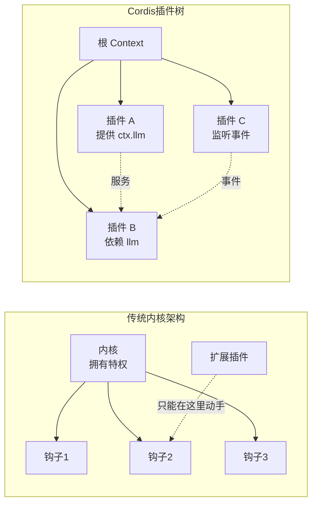
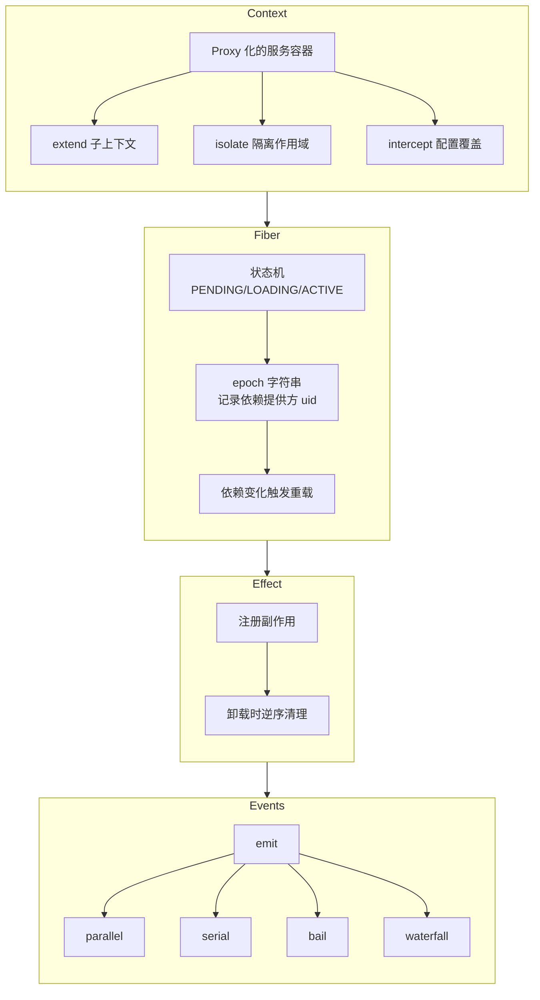
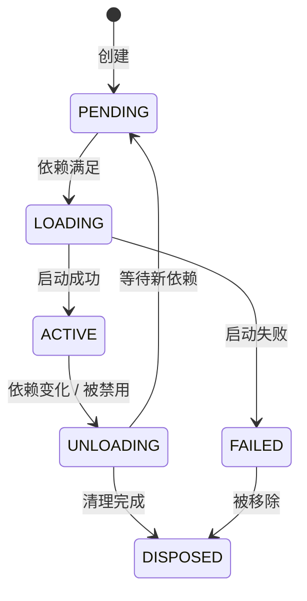
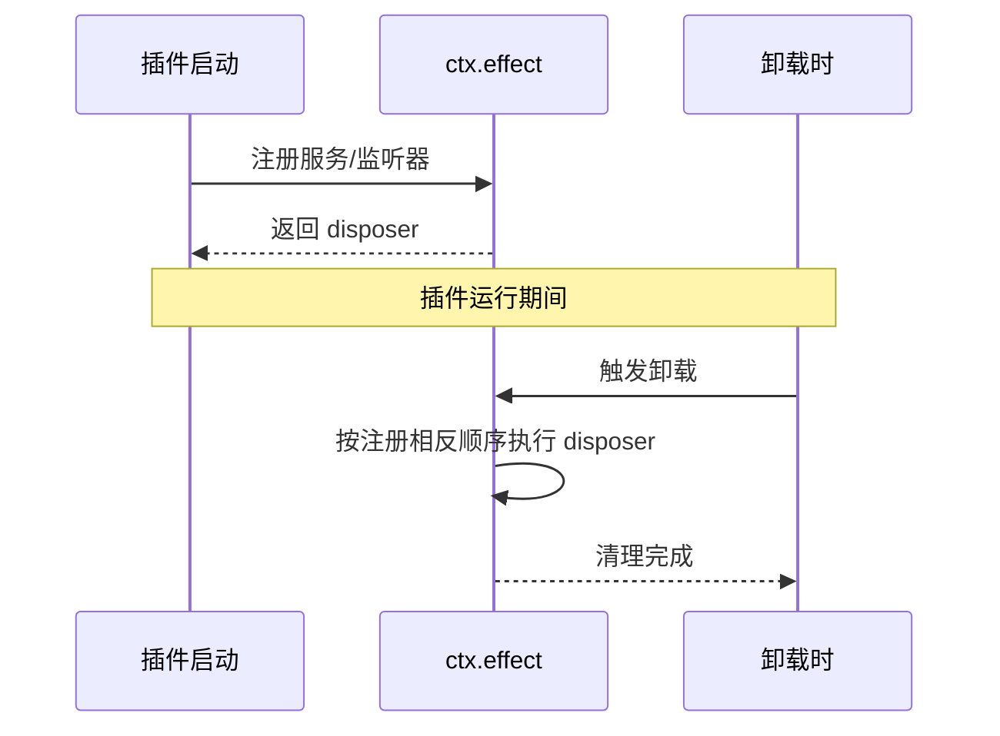
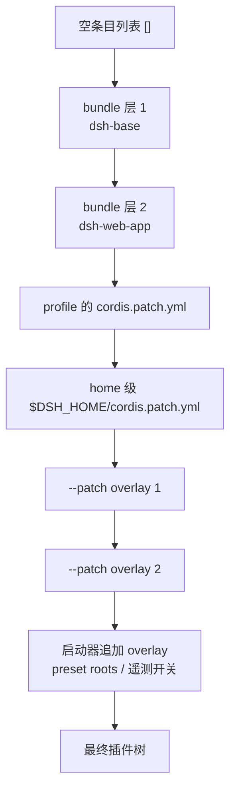
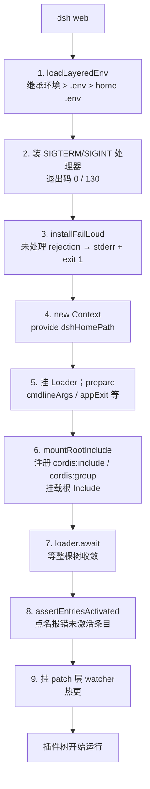

# 第 1 章：Cordis 框架与插件组装

> 本章导读：dsh 没有传统意义上的"内核"——它是一棵由 Cordis 框架组装出来的插件树。读完本章，你会理解四件事：① Cordis 如何用 Context、Fiber、effect、事件四个抽象支撑起整棵树；② 依赖驱动的加载语义如何让插件自动等待依赖、自动重载；③ profile、bundle、patch 三层如何把配置叠成一棵可运行的树；④ `dsh web` 从命令行到插件树完全启动的完整序列。本章是后续所有章节的词汇基础。

## 1.1 Cordis 解决什么问题

一个 agent harness 里有几十个能力模块：模型适配、工具、会话存储、审批、沙箱、UI 等。传统做法是写一个**内核**，在内核里预留一堆钩子，扩展者只能在内核允许的点上动手脚。

Cordis 走另一条路：**没有内核，只有一棵插件树**。每个插件向共享上下文贡献三样东西：

- **服务**：带类型的对象，如 `ctx.llm`、`ctx.tools`。
- **事件**：类型化的事件声明与监听。
- **副作用**：注册即生效、卸载即撤销的 effect。

框架本身只负责三件事：解析依赖、管理生命周期、分发事件。产品的每一部分——包括 agent loop 本身——都是插件，因此每一部分都可以被替换。



dsh 把 Cordis 源码 vendor 进仓库（`vendor/cordis`，上游 cordis 4.0.0-rc.7 加若干本地改动），因此框架语义与产品语义在同一个仓库里共同演进。

## 1.2 四个核心抽象

Cordis 的所有机制都建立在四个抽象上：Context、Fiber、effect、事件。先建立一个整体关系图：



### 1.2.1 Context：proxy 化的服务容器

`new Context()` 返回一个 Proxy。读取 `ctx.llm` 时，proxy 处理器会沿着 fiber 链向上查找该服务的实现；**没有声明 `inject` 就读取未提供的服务会直接抛错**。

这个设计把"依赖"从隐式的 import 变成了显式的运行时契约：

- 插件声明 `inject = ['llm']`，依赖缺失时插件会停在 `PENDING` 状态，不会带半残依赖启动。
- 依赖的实现被替换（比如 HMR 热更、换适配器），依赖方会自动卸载并按新依赖重载。

Context 还提供三个作用域工具：

| 方法 | 作用 | 典型用途 |
|---|---|---|
| `ctx.extend(meta)` | 原型继承出子上下文 | 每个插件获得自己的子上下文 |
| `ctx.isolate(name, label?)` | 让某个服务名在隔离 realm 里解析 | agent preset 中同名服务互不冲突（见[第 9 章](09-编排能力.md)） |
| `ctx.intercept(name, config)` | 为子树注入服务级 config 覆盖 | 沿链合并配置 |

### 1.2.2 Fiber：插件的生命周期状态机

`ctx.plugin()` 为插件创建一个 **Fiber**，即插件的运行实例。Fiber 的状态机如下：



关键机制是 **epoch**：Fiber 把每个 `inject` 服务实现提供者的 fiber uid 拼成一个 epoch 字符串。任何依赖消失或被替换都会使 epoch 失效，触发"卸载 → 按新 epoch 重载"。

这实现了"加载顺序由 inject 表达"：不需要手写启动顺序，依赖图自己收敛。

子 Fiber 的 dispose 注册为父 Fiber 的 effect，所以 dispose 父插件会逆序 dispose 整个子树——插件树的 teardown 语义由此而来。

### 1.2.3 effect：可逆的副作用

`ctx.effect(execute)` 立即执行回调，收集其返回的 disposer；fiber 卸载时逆序执行所有 disposer。



`ctx.on()`（事件监听）、`ctx.provide()`（服务注册）、`ctx.mixin()` 全部建立在 effect 之上。dsh 仓库级约定"注册即 effect"：每个 `register()` 都返回 disposer，因此任何插件被卸载时，它的贡献会被干净地撤销。

### 1.2.4 事件：五种分发模式

Cordis 事件不是简单的 pub/sub，而是五种语义不同的分发模式：

| 模式 | 是否等待 | 是否返回值 | 核心语义 | dsh 典型用途 |
|---|---|---|---|---|
| `emit` | 否 | 否 | 同步触发，不等待 | `session/event` 广播 |
| `parallel` | 是 | 否 | `Promise.allSettled`，聚合错误 | `session/flush` 持久化检查点 |
| `serial` | 是 | 是 | 按注册序逐个 await，遇 bail 值即返回 | `agent/turn-stopping` |
| `bail` | 否 | 是 | serial 的同步版 | 内部机制 |
| `waterfall` | 否 | 是 | 监听器环绕 `next`，不调用 `next()` 即短路 | `agent/pre-step`、`agent/request`、`llm/stream`、`tools/*` |

`waterfall` 是 dsh 最重要的扩展形态。监听器既能加工传下去的值，也能整体接管——不调用 `next()` 就没有内建行为。仓库级约定："waterfall 监听器必须调用 `next()` 才能委托下去"。

`serial`/`bail` 中的"bail 值"指任何非 null、非 false、非 undefined 的返回值。监听器注册时可加 `prepend: true`，使其排在普通注册之前。

此外还有一组 `internal/*` 内建事件，框架自身的可替换点也走事件。例如服务查找是 `internal/get` waterfall、配置更新是 `internal/update` waterfall。

## 1.3 配置文件如何变成插件树

框架之上，`vendor/` 里还有一组框架插件，负责把"配置文件"变成"运行的树"：

- **loader**：持有 `EntryTree`，每个 `Entry` 绑定一个 fiber。`Entry.update()` 是**事务**：名称/依赖变化时先 import 新模块、dispose 旧 fiber、起新 fiber，失败则回滚到旧插件。
- **group**：`config` 即子条目列表，挂载嵌套条目组。
- **include**：文件背书的条目树，并导出 patch 语义的唯一实现 `applyEntryPatches(data, patches)`（`vendor/include/src/index.ts`）。
- **hmr**：监视模块与配置文件。改源码做局部重载；改 patch 文件触发重组。

一个典型的 `cordis.yml` 条目长这样：

```yaml
- id: shell
  name: '@deepseek-ai/dsh-shell'
  inject:
    - subprocess
    - sandbox
- id: tools
  name: '@deepseek-ai/dsh-tools'
  config:
    defaultPolicy: allow
```

Loader 会按 `inject` 等待依赖，依赖满足后再启动插件。

## 1.4 组装：profile、bundle、patch 分层叠加

### 1.4.1 三个核心概念

运行中的 dsh = **空条目列表 + 一组 patch 层按序叠加**，经同一次 `applyEntryPatches` 调用组合出条目树。

- **组合包（bundle）**：分发给用户的"配置项 + 挂载代码"单元。一个 npm 包，在 `package.json` 里用 `dsh.bundle.patch` 指向自己的 patch 文件。
- **profile**：Harness home 里的具名组装。一个目录，含 `package.json`（其 `dsh.profile.bundles` 按序列出叠放的组合包）、自己的 `cordis.patch.yml`。
- **patch 层**：每条 patch 要么按 id 定位并替换条目，要么 `insert` 插入新条目。

发行版自带三个 bundle：

| bundle | 职责 |
|---|---|
| `dsh-base` | 模型适配器、工具、持久化、沙箱与审批策略、设置、凭据、遥测 |
| `dsh-web-app` | 浏览器应用 |
| `dsh-headless` | 一次性运行器，完全不带服务器 |

`web` 和 `headless` 作为 profile 模板随发行交付，首次使用自动初始化。

### 1.4.2 层叠顺序



同一行后写获胜。任何一层都不特殊：内置组合包与你的 patch 走同一个 `applyEntryPatches`。

### 1.4.3 patch 语义

一条 patch 有两种形态：

- `{id, ...overrides}`：按 id 定位条目，**整键替换**。patch 里写 `config` 就是整份替换，不做深合并。
- `{insert: [...]}`：无 id 时追加到根；有 id 时追加到该 group 条目。insert 的行即时入索引，同一层后续的 patch 可以命中它。

用一个例子说明。假设 base 层插入：

```yaml
# dsh-base 的 patch
- id: llm
  name: '@deepseek-ai/dsh-llm'
  config:
    provider: deepseek
- id: tools
  name: '@deepseek-ai/dsh-tools'
  config:
    defaultPolicy: allow
```

profile 的 `cordis.patch.yml` 可以这样覆盖：

```yaml
# profile 的 cordis.patch.yml
- id: llm
  config:
    provider: openai      # 整份替换，不是 deep merge
    temperature: 0.7

- insert:
    - id: custom-tool
      name: './my-tool.ts'
```

未命中的 patch 只告警不报错。这个"整键替换 + id 定位 + insert 索引"的组合意味着：上层可以整体改写下层插入的任何条目，且可以插入新条目给更上层继续改。

可以用 `--dump-config` 查看最终组合结果：

```sh
dsh --profile web --dump-config
```

`--dump-config` **不启动任何插件树**，用 include 包自己的 schema 和 `applyEntryPatches` 做组合，逐行标注来源。

### 1.4.4 热更新

启动器把 profile 和 home 两份 patch 文件注册进 HMR。文件变更时：

1. 重读两份文件；
2. 按原层序重新组合；
3. 用 `entry.update` 替换根 Include 的 patches。

也就是说，**改配置文件可以在不重启进程的情况下重组整棵树**，而 Entry 事务保证重组失败时回滚。

## 1.5 启动序列：从 `dsh web` 到运行的插件树

`apps/cli` 的 bin 是个极薄的启动器，只认 `--profile/--patch/--dump-config` 等少数参数。`web` 是 `--profile web` 的硬编码别名。

完整启动序列：



profile 根的 `cordis.yml` 每次启动被重写为空列表——因为 Loader 的写回会把组合结果烤进文件，而 dsh 要的是"每次从各层重新组合"。

退出走 `createProcessShutdown`：5 秒优雅期后强退。

### host/client 双面构建

`DSH_BUILD_FACE` 是纯构建期概念。

- **Host 面**：所有包编译 Node lib 并跑 Typert 代码生成。
- **Client 面**：声明了浏览器 bundle 的包产出 `lib/client.js`（CJS factory，浏览器里经 `window.__ModuleLoader__` 加载）。

一条 `dsh.client` 配置行因此可以同时是 host 插件和浏览器模块名录——Web 架构详见[第 10 章](10-应用与对外接口.md)。

## 1.6 设计取舍

**为什么 vendor Cordis 而不是当依赖用？**

框架语义即产品语义（epoch 重载、事务化 Entry、懒 `!!js` 求值都是实质行为），pin 源码副本让所有本地改动有清单、可审计（`vendor/README.md` 记录上游 SHA 与本地修改）。

**为什么组装用"patch 层"而不是"配置文件合并"？**

深合并语义模糊且难以撤销；patch 的"整键替换 + id 定位 + insert 索引"让每个条目的来源可追溯（`dump-config` 能标注每一行来自哪一层），替换语义对使用者和工具都简单。代价是改一个字段也要整份重述 config——dsh 用"条目尽量小、config 尽量扁平"来消化这个代价。

**为什么启动审计不可少？**

声明式组装最大的风险是"配置写错了但树看起来起来了"。`PENDING`（依赖永远不满足）和 `FAILED` 在启动时被点名，把配置错误的暴露时间提前到最早可判定点——这是仓库"misconfiguration fails loud"规则的落点。

## 1.7 关键实现入口

| 文件 | 职责 |
|---|---|
| `vendor/cordis/src/context.ts` | Context proxy、extend/isolate/intercept |
| `vendor/cordis/src/fiber.ts` | Fiber 状态机、effect/dispose、epoch 重载 |
| `vendor/cordis/src/events.ts` | 五种分发模式、waterfall next 语义、internal 事件 |
| `vendor/cordis/src/registry.ts` | 插件形态解析、inject 归一化 |
| `vendor/loader/src/config/entry.ts` | Entry 事务化 update、disabled 求值 |
| `vendor/include/src/index.ts` | `applyEntryPatches`：patch 语义唯一实现 |
| `vendor/hmr/src/index.ts` | 模块/配置监视、局部与全量重载 |
| `packages/boot/app-boot/src/index.ts` | boot()、mountRootInclude、watchUserPatches、dump-config |
| `packages/boot/app-boot/src/profile.ts` | profile 发现/初始化、bundle 双锚点解析、composeEntries |
| `apps/cli/src/profile-boot.ts` | dsh profile 启动器、patch 层组合、热更 watcher |
| `apps/cli/src/{args,bin}.ts` | dsh 命令行入口 |
| `packages/bundle/{base,web-app,headless}/cordis.patch.yml` | 三个随发行组合包的层内容 |

## 1.8 小结

Cordis 给 dsh 提供了三个结构性性质：

1. **依赖驱动**：`inject` 推导加载与重载；
2. **可逆**：`effect` 使一切注册可撤销；
3. **可拦截**：`waterfall` 使一切行为可包裹。

组装机制再进一步：连"哪些插件在场"也是数据（patch 层），可以用同一套语义替换。下一章我们看这棵树在仓库里具体长什么样。
