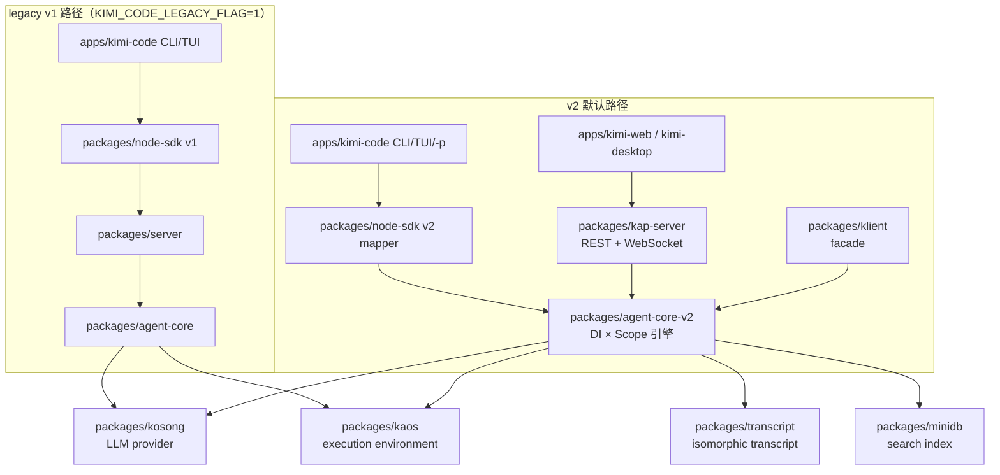

# How Kimi Code Works

> **文档同步跟踪**
> - 最后同步代码：`kimi-code` commit `c3a2ef0ce`（2026-08-27）
> - 同步方式：基于 git log、包结构和关键源码路径梳理
> - 说明：v1 架构部分内容仍有效；v2 / kap-server 等新模块已在本仓库后续文档中补充

这是一组面向源码阅读的 Kimi Code 拆解笔记。

写法上刻意采用“先给心智模型，再沿真实代码路径下钻”的方式：不把仓库当成文件列表解释，而是把它当成一个正在运行的系统来拆。

## 阅读入口

- [01. 整体架构](docs/01-overview.md)
- [02. Plan Mode 是怎么运行的](docs/02-plan-mode.md)
- [03. Subagent 与委托任务](docs/03-subagents-and-delegation.md)
- [04. Tool 系统与执行 Harness](docs/04-tool-system.md)
- [05. 安全与权限机制](docs/05-security-and-permissions.md)
- [06. 执行环境与宿主探测](docs/06-execution-environment.md)
- [07. agent-core-v2 与 kap-server 新架构](docs/07-agent-core-v2.md)
- [源码索引](docs/source-map.md)

## 一句话总览

Kimi Code 是一个多入口、双引擎并存的 Agent 系统：

- CLI/TUI 默认走新的 **agent-core-v2** 引擎，保留 `KIMI_CODE_LEGACY_FLAG` 回退到 v1。
- `kimi web` 永远启动 **kap-server**，背后就是 agent-core-v2。
- Web/Desktop 通过 kap-server 暴露的 REST/WebSocket 协议接入。
- Node SDK 同时桥接 v1 与 v2，上层调用方基本无感。
- v2 引擎采用 **DI × Scope** 架构，把 Session、Agent、工具、权限、Plan、Goal、Swarm、Tower、Skill、MCP 等组织成可装配的 Feature。

## 当前覆盖范围

这版覆盖七个主题：

1. 从入口到 Agent Loop 的整体架构（v1 路径）。
2. Plan Mode 的状态、注入、权限、UI 审批和退出流程。
3. Subagent / Agent 委托、AgentSwarm、后台任务和 UI 事件流。
4. Tool 的来源、执行 harness、权限、并行调度和批量 AgentSwarm。
5. 安全与权限机制：应用层策略链、异步审批、glob 规则、工作区信任。
6. 执行环境与宿主探测：借宿主而非造环境、PATH 补全、Windows bash 定位。
7. **agent-core-v2 与 kap-server 新架构**：DI × Scope、四层生命期、Feature 装配、Workspace 实例、Session / Agent 生命周期、kap-server 协议面、klient facade、v1/v2 切换。

后续可以继续按同样风格补：

- v2 的 turn loop 与 tool execution
- v2 的 Plan / Goal / Tower / Swarm Feature
- MCP 和插件（v2 的 mcpConfig / mcpRegistry / mcpManagement）
- kap-server 的 transcript 投影和事件广播
- compact / context 管理