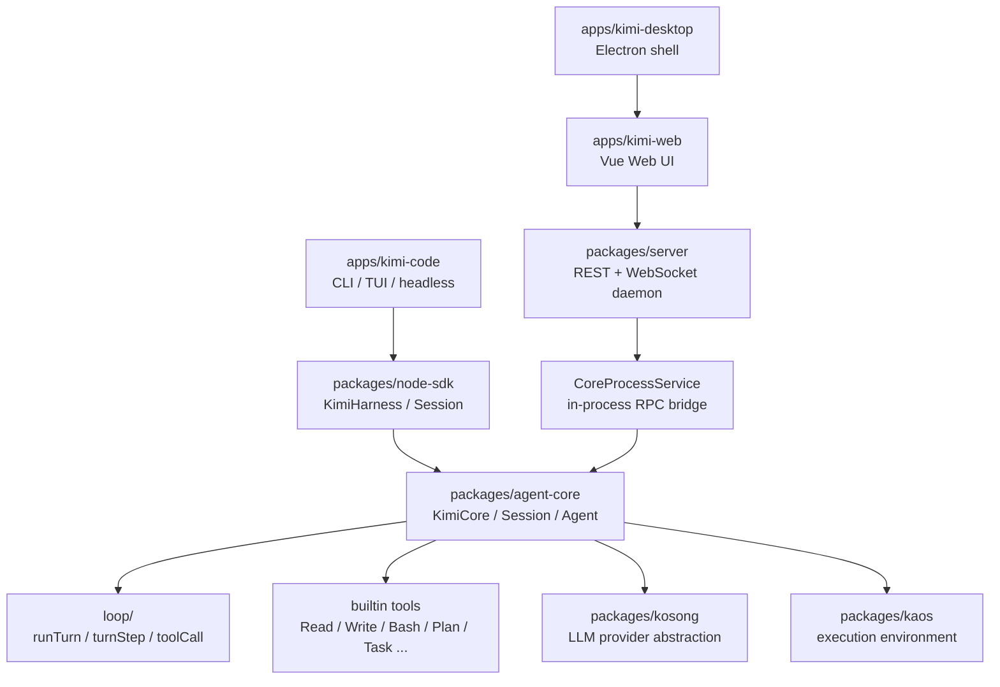

# How Kimi Code Works

这是一组面向源码阅读的 Kimi Code 拆解笔记。

写法上刻意采用“先给心智模型，再沿真实代码路径下钻”的方式：不把仓库当成文件列表解释，而是把它当成一个正在运行的系统来拆。

## 阅读入口

- [01. 整体架构](docs/01-overview.md)
- [02. Plan Mode 是怎么运行的](docs/02-plan-mode.md)
- [03. Subagent 与委托任务](docs/03-subagents-and-delegation.md)
- [04. Tool 系统与执行 Harness](docs/04-tool-system.md)
- [05. 安全与权限机制](docs/05-security-and-permissions.md)
- [06. 执行环境与宿主探测](docs/06-execution-environment.md)
- [源码索引](docs/source-map.md)

## 一句话总览

Kimi Code 是一个多入口的 Agent 系统：

- CLI/TUI 是最直接的交互入口。
- Web/Desktop 通过本地 daemon 暴露的 REST/WebSocket 协议接入。
- Node SDK 把同一套 Agent Core 包成可编程接口。
- Agent Core 负责 Session、Agent、LLM loop、工具、权限、Plan Mode、技能、MCP、hooks 等核心语义。

## 当前覆盖范围

这版先覆盖六个主题：

1. 从入口到 Agent Loop 的整体架构。
2. Plan Mode 的状态、注入、权限、UI 审批和退出流程。
3. Subagent / Agent 委托、AgentSwarm、后台任务和 UI 事件流。
4. Tool 的来源、执行 harness、权限、并行调度和批量 AgentSwarm。
5. 安全与权限机制：应用层策略链、异步审批、glob 规则、工作区信任。
6. 执行环境与宿主探测：借宿主而非造环境、PATH 补全、Windows bash 定位。

后续可以继续按同样风格补：

- Session 持久化与恢复
- MCP 和插件
- Web daemon 协议
- compact / context 管理
