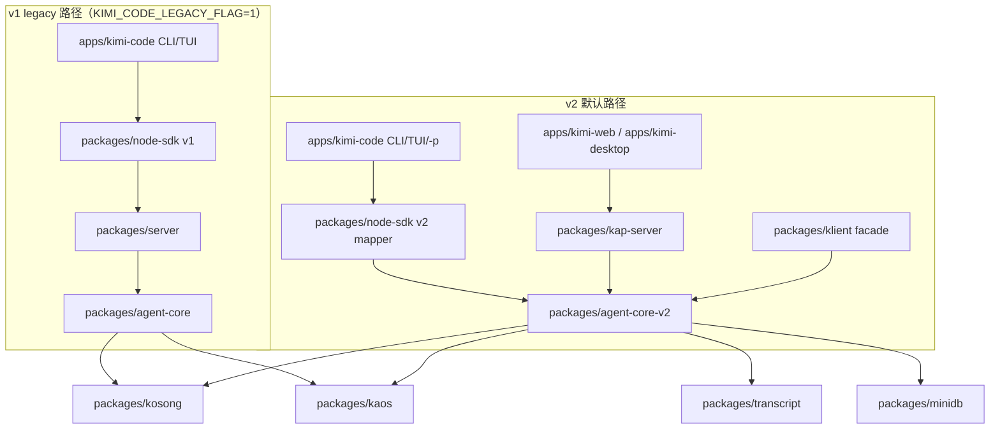
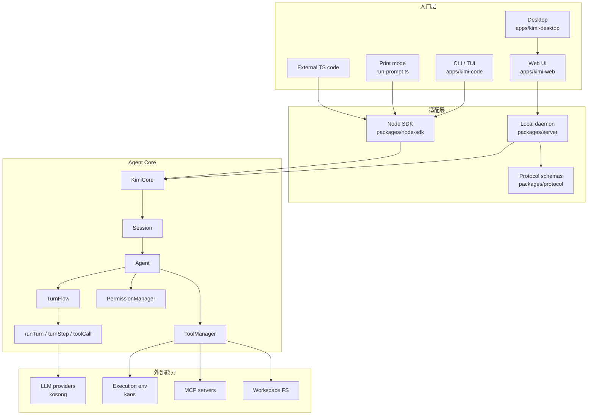

# 01. 整体架构


> **文档同步跟踪**
> - 最后同步代码：`kimi-code` commit `c3a2ef0ce`（2026-08-27）
> - 同步方式：基于该文档撰写时的源码路径与提交记录梳理

如果只看目录，Kimi Code 像一个常见的 monorepo：有 CLI、有 Web、有 Desktop、有 SDK、有 server、有 core。

但从运行时看，它更像是围绕 `Agent Core` 建了多层壳。需要特别说明：从 2026 年 7 月开始，仓库里并存着两套 Agent Core——

- **v1**：`packages/agent-core`，本文 1–13 节描述的架构。
- **v2**：`packages/agent-core-v2`，基于 DI × Scope 的新引擎，详见 [07. agent-core-v2 与 kap-server 新架构](07-agent-core-v2.md)。

在默认情况下：

- CLI / TUI / `kimi -p` 已经默认走 v2，除非设置 `KIMI_CODE_LEGACY_FLAG=1`。
- `kimi web` 永远启动 `packages/kap-server`，背后就是 v2。
- Web / Desktop 不再走 `packages/server`，而是走 `kap-server`。

所以从 2026 年开始，原图需要扩展成两条并行路径：



下面 1–13 节仍按 v1 路径讲解，因为 v1 的源码结构和概念是理解 v2 的基础；v2 的完整心智模型请转 07。

## 1. 仓库分层

先给一个粗分层：

```text
kimi-code/
  apps/
    kimi-code/       # CLI / TUI / headless print mode
    kimi-web/        # Vue Web UI
    kimi-desktop/    # Electron desktop wrapper
    vis/             # 可视化辅助应用
  packages/
    agent-core/      # Agent runtime 核心（v1 引擎）
    agent-core-v2/   # 新 Agent runtime 核心（v2 引擎，DI × Scope）
    kap-server/      # 基于 agent-core-v2 的 REST + WebSocket daemon
    klient/          # v2 统一客户端 facade（memory / ipc / rest）
    transcript/      # 同构转录数据层（浏览器 + 服务器共享）
    minidb/          # 嵌入式 JSON 文档存储（搜索索引）
    node-sdk/        # SDK 入口，给 CLI 或外部程序使用（桥接 v1 / v2）
    server/          # 本地 REST + WebSocket daemon（v1 后端）
    protocol/        # REST / WS schema 和事件类型
    acp-adapter/     # Agent Client Protocol 适配
    kaos/            # 执行环境抽象
    kosong/          # LLM provider 抽象
```

`package.json` 和 `pnpm-workspace.yaml` 说明这是 pnpm workspace。根脚本把几个入口并列暴露出来：`dev:cli`、`dev:web`、`dev:desktop`、`dev:server`、`vis`、`test`、`typecheck`、`build`。

这也暗示了一个重要事实：Kimi Code 不是“一个 CLI 项目顺手带了 Web UI”，而是一个以 Agent runtime 为中心、多个产品入口共享核心语义的系统。

## 2. 运行时大图



这张图里最关键的是中间的窄腰：

```text
入口层 -> SDK / daemon -> KimiCore -> Session -> Agent -> TurnFlow -> loop
```

无论用户从 CLI、Web、Desktop 还是 SDK 进入，最终都要落到 `Agent` 的一轮或多轮 turn 上。

## 3. CLI 入口：先决定运行模式

CLI 的最外层入口在 `apps/kimi-code/src/main.ts`。

`main()` 做几类事情：

- 安装 crash handler、proxy、native hooks。
- 创建 Commander program。
- 注册 root command 和子命令。
- 解析参数后进入 `handleMainCommand()`。

关键分支在 `handleMainCommand()`：

```text
uiMode === "print" -> runPrompt()
否则              -> runShell()
```

对应源码：

- `apps/kimi-code/src/main.ts:54`
- `apps/kimi-code/src/main.ts:135`
- `apps/kimi-code/src/cli/commands.ts:35`

Root command 上暴露的选项也很能说明系统能力：

- `--prompt` / `--print`：不进 TUI，直接跑 headless prompt。
- `--session` / `--continue`：恢复已有会话。
- `--yolo` / `--auto`：权限策略快捷入口。
- `--model`：指定模型。
- `--skills-dir` / `--add-dir`：扩展技能和工作目录。
- `--plan`：启动时进入 Plan Mode。

## 4. TUI 入口：创建 Harness，再创建 Session

交互式 CLI 会进 `runShell()`：

- 读取 TUI 配置和 theme。
- 创建 `KimiHarness`。
- 初始化 `KimiTUI`。
- 启动 TUI 主循环。

源码入口：

- `apps/kimi-code/src/cli/run-shell.ts:34`
- `apps/kimi-code/src/cli/run-shell.ts:102`
- `apps/kimi-code/src/cli/run-shell.ts:212`

`KimiTUI` 启动后会决定是新建 session 还是恢复 session：

- 新 session：`harness.createSession(...)`
- 恢复 session：`harness.resumeSession(...)`

其中启动参数里的 `--plan` 会被传进 `createSessionOptions`：

```text
startup.plan -> createSessionOptions.planMode = true
```

对应源码：

- `apps/kimi-code/src/tui/kimi-tui.ts:669`
- `apps/kimi-code/src/tui/kimi-tui.ts:1414`
- `apps/kimi-code/src/tui/kimi-tui.ts:1459`

这说明 TUI 本身不直接拥有 Agent 逻辑。它持有的是一个 SDK session，再通过 session 去发 prompt、订阅事件、切换状态。

## 5. SDK 是第一层窄腰

`packages/node-sdk` 把 core 包成用户能调用的对象：

- `KimiHarness`
- `Session`
- `createKimiHarness`

`KimiHarness.createSession()` 的职责很薄：

1. 调 RPC 创建 core session。
2. 包装成 SDK `Session` 对象。
3. 如果传了 `planMode: true`，调用 `session.setPlanMode(true)`。

源码：

- `packages/node-sdk/src/kimi-harness.ts:92`
- `packages/node-sdk/src/session.ts:104`
- `packages/node-sdk/src/session.ts:219`

SDK 的 `Session.prompt()` 并不自己跑模型，而是把请求转给 core RPC：

```text
SDK Session.prompt()
  -> rpc.session[sessionId].prompt()
  -> Agent.rpcMethods.prompt()
  -> TurnFlow.prompt()
```

这个设计让 CLI 入口足够轻。CLI 管 UI，SDK 管 RPC 形状，core 管语义。

## 6. KimiCore：装配 Session 的工厂

`packages/agent-core/src/rpc/core-impl.ts` 里的 `KimiCore` 是 core 的总装配点。

创建 session 时，它会集中解析这些东西：

- 配置与 override
- 模型和 thinking 配置
- permission mode
- MCP 配置
- workspace directories
- Kaos 执行环境
- session store
- plugin manager
- default plan mode

然后构造 core `Session`，再创建 main `Agent`。

源码：

- `packages/agent-core/src/rpc/core-impl.ts:142`
- `packages/agent-core/src/rpc/core-impl.ts:215`
- `packages/agent-core/src/rpc/core-impl.ts:321`

这里有一个重要细节：`config.defaultPlanMode` 只对新 session 生效，不会覆盖恢复出来的旧 session。

## 7. Session：容器和上下文边界

core `Session` 不是一轮对话，它更像一个运行容器：

- 管日志和 replay。
- 管 hook engine。
- 管 skills。
- 管 MCP。
- 管 Kaos。
- 管 agents。
- 创建 main agent。

源码：

- `packages/agent-core/src/session/index.ts:151`
- `packages/agent-core/src/session/index.ts:291`
- `packages/agent-core/src/session/index.ts:425`
- `packages/agent-core/src/session/index.ts:467`

`Session.createMain()` 创建主 Agent，`Session.createAgent()` 创建具体 Agent 实例。Agent 初始化时会拿到 system prompt context、tool registry、permission manager、plan mode、skills 等。

## 8. Agent：真正的运行主体

Agent 聚合了这一轮智能体运行所需的核心组件：

- `llm`
- `context`
- `turn`
- `injection`
- `permission`
- `planMode`
- `swarmMode`
- `skills`
- `tools`
- `goal`

源码：

- `packages/agent-core/src/agent/index.ts:96`
- `packages/agent-core/src/agent/index.ts:247`
- `packages/agent-core/src/agent/index.ts:328`
- `packages/agent-core/src/agent/index.ts:485`

Agent 暴露给 RPC 的方法也很直接：

- `prompt`
- `steer`
- `abort`
- `setPlanMode`
- `getPlan`
- `clearPlan`
- `setPermissionMode`
- `runShell`

也就是说，Agent 是 core 里最像“产品语义 API”的对象。

## 9. TurnFlow：把一次用户输入变成可执行 turn

用户输入最终进入 `TurnFlow.prompt()`。

`TurnFlow` 做的事情包括：

- 处理当前是否已有 active turn。
- 支持 steer。
- 执行 user prompt hook。
- 注入 system / dynamic reminders。
- 跑 step loop。
- 结束时发 `turn.ended`。

源码：

- `packages/agent-core/src/agent/turn/index.ts:102`
- `packages/agent-core/src/agent/turn/index.ts:340`
- `packages/agent-core/src/agent/turn/index.ts:480`
- `packages/agent-core/src/agent/turn/index.ts:665`

一个关键点：`TurnFlow` 不直接把工具和模型揉在一起，它会把真正的“模型一步、工具一步”交给 `loop/`。

## 10. loop：尽量无状态的模型-工具循环

`packages/agent-core/src/loop/README.md` 说得很清楚：loop 层刻意保持无状态，不拥有 session、transport、permission UI、durable bridging。

它分成几个模块：

- `run-turn.ts`：turn 级别 step loop。
- `turn-step.ts`：一次 provider request / response。
- `tool-call.ts`：工具调用生命周期。
- `tool-scheduler.ts`：工具并发与资源冲突调度。

源码：

- `packages/agent-core/src/loop/README.md:3`
- `packages/agent-core/src/loop/run-turn.ts:54`
- `packages/agent-core/src/loop/turn-step.ts:48`
- `packages/agent-core/src/loop/tool-call.ts:123`
- `packages/agent-core/src/loop/tool-scheduler.ts:28`

一轮 turn 的内核可以理解成：

```mermaid
sequenceDiagram
  participant Turn as TurnFlow
  participant Loop as runTurn
  participant Step as turnStep
  participant LLM as LLM Provider
  participant Tools as Tool Scheduler

  Turn->>Loop: runTurn(agent, messages)
  loop until stop
    Loop->>Step: run one step
    Step->>LLM: chat(messages, tools)
    LLM-->>Step: assistant message / tool_use
    alt has tool calls
      Step->>Tools: runToolCallBatch()
      Tools-->>Step: tool results
      Step-->>Loop: continue
    else no tool calls
      Step-->>Loop: stop
    end
  end
  Loop-->>Turn: final turn result
```

这层的价值是“纯”：它关心 provider step、tool call、ordering，不关心 TUI、Web、审批弹窗长什么样。

## 11. ToolManager：把工具变成模型可见能力

工具系统在 `packages/agent-core/src/agent/tool/index.ts`。

初始化时会注册大量内置工具：

- 文件类：`Read`、`Write`、`Edit`、`Grep`、`Glob`
- 执行类：`Bash`
- 规划类：`EnterPlanMode`、`ExitPlanMode`
- 协作类：`AskUserQuestion`、`Task`、`Agent`
- 管理类：`Todo`、`Goal`、`Cron`、`Skill`
- 网络类：`WebSearch`、`FetchURL`
- MCP tools

源码：

- `packages/agent-core/src/agent/tool/index.ts:459`
- `packages/agent-core/src/agent/tool/index.ts:594`

`ToolManager.loopTools()` 会返回当前对模型可见的工具列表。Plan Mode、Goal、MCP glob、权限模式都会影响最终工具可用性或执行结果。

## 12. Web / Desktop：通过 daemon 使用同一套 core

Web 不是直接 import `agent-core`，它通过本地 daemon 的 REST + WebSocket 协议控制 core。

server 启动入口：

- `packages/server/src/start.ts:120`
- `packages/server/src/routes/registerApiV1Routes.ts:63`

路由包括：

- sessions
- prompts
- approvals
- questions
- tools
- skills
- tasks
- fs
- workspaces
- terminals

Web daemon client：

- `apps/kimi-web/src/api/daemon/client.ts:243`
- `apps/kimi-web/src/api/daemon/ws.ts:1`

Desktop 更像是 Electron 壳：

- 确保 daemon 启动。
- 加载 Web UI。
- 把 token 等启动信息传给 Web。

源码：

- `apps/kimi-desktop/src/main/index.ts:119`
- `apps/kimi-desktop/src/main/index.ts:233`

所以 Web/Desktop 的本质不是另一套 Agent，而是同一套 core 的图形化控制面。

## 13. 这套架构的核心取舍

Kimi Code 的架构可以总结成三个取舍。

第一，入口很多，但核心只有一个。

CLI、TUI、headless、Web、Desktop、SDK 都会汇入 `KimiCore -> Session -> Agent` 这条路径。这样能力不会在多个入口重复实现。

第二，运行语义集中在 Agent Core。

Plan Mode、权限、工具、LLM loop、skills、MCP、hooks 都在 core 里，而不是散落在 UI。UI 主要做状态展示、输入收集和审批交互。

第三，loop 层保持低耦合。

真正的模型-工具循环被拆到 `loop/`，并且刻意不持有 session 和 transport。这让它更像一个可测试、可替换的执行内核。

需要补充的一点是：这套图在 2026 年 7 月之后变成了**默认路径的 legacy 路径**。读新代码时，CLI / TUI 入口应先看 `apps/kimi-code/src/cli/experimental-v2.ts`、`apps/kimi-code/src/cli/run-shell.ts`、`apps/kimi-code/src/cli/run-prompt.ts`；Web 入口应直接看 `packages/kap-server/src/start.ts` 和 `packages/klient/src/core/klient.ts`。详细的双引擎对比与 v2 架构见 [07. agent-core-v2 与 kap-server 新架构](07-agent-core-v2.md)。

从读源码的角度，建议后续按这个顺序继续下钻：

```text
main.ts
  -> run-shell.ts / run-prompt.ts
  -> node-sdk Session
  -> KimiCore.createSessionWithOverrides()
  -> core Session.createMain()
  -> Agent.rpcMethods.prompt()
  -> TurnFlow.prompt()
  -> loop/run-turn.ts
  -> loop/turn-step.ts
  -> loop/tool-call.ts
```

如果你关注的是 2026 年之后的默认行为，建议的读码顺序是：

```text
apps/kimi-code/src/cli/experimental-v2.ts   # 判断走 v1 还是 v2
apps/kimi-code/src/cli/run-shell.ts          # TUI 默认 v2
apps/kimi-code/src/cli/run-prompt.ts         # kimi -p 默认 v2
packages/kap-server/src/start.ts             # kimi web 永远走这里
packages/agent-core-v2/src/app/bootstrap/bootstrapService.ts
packages/agent-core-v2/src/app/sessionManager/sessionManagerService.ts
packages/agent-core-v2/src/workspace/sessionLifecycle/sessionLifecycleService.ts
packages/agent-core-v2/src/session/agentLifecycle/agentLifecycleService.ts
packages/agent-core-v2/src/agent/loop/
```
