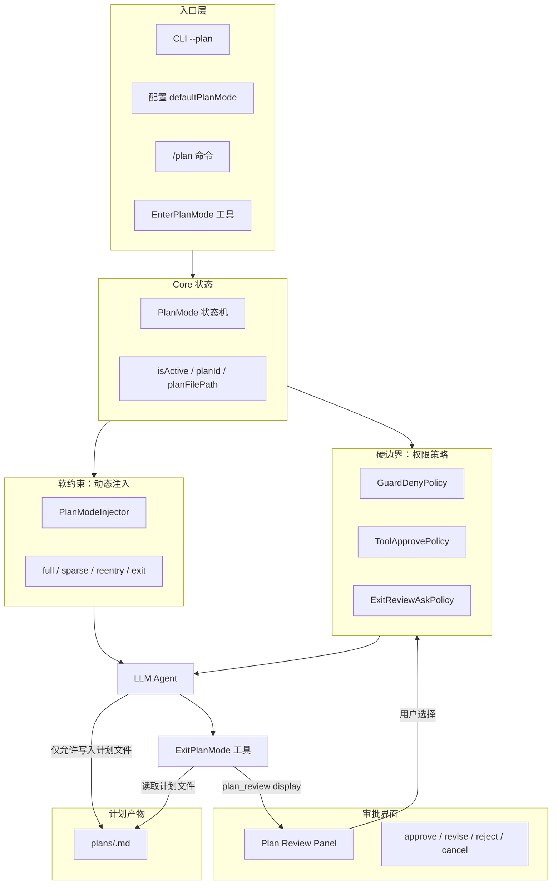
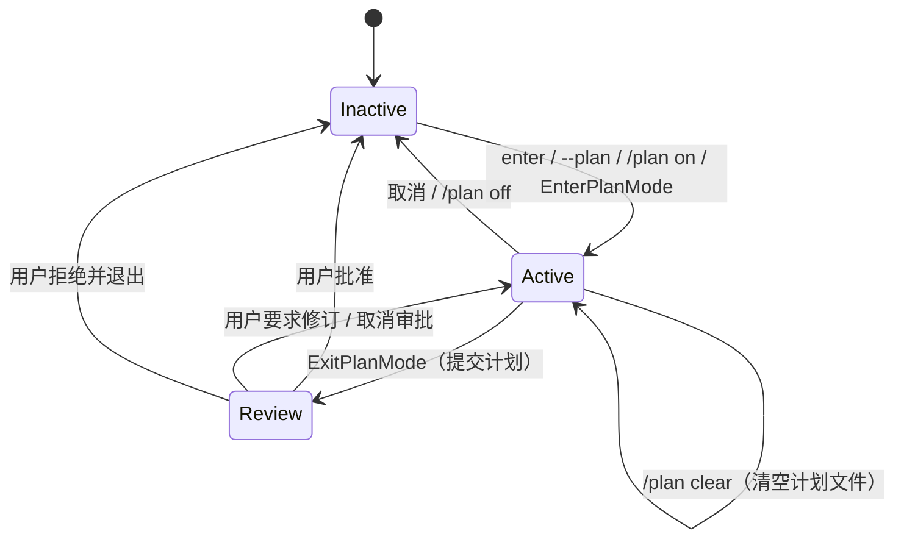
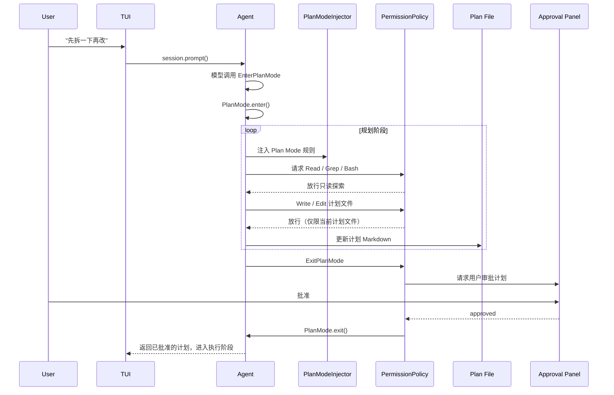

# 02. Plan Mode 的设计与运行


> **文档同步跟踪**
> - 最后同步代码：`kimi-code` commit `c3a2ef0ce`（2026-08-27）
> - 同步方式：基于该文档撰写时的源码路径与提交记录梳理

Plan Mode 不是“让模型先写一段计划”这么简单的功能。它是一个**运行时约束机制**：在计划被用户批准之前，Agent 只能读取、思考、编辑计划文件本身，不能修改任何业务文件。只有用户批准后，Plan Mode 才退出，Agent 回到正常执行状态。

这种设计的出发点是：复杂或高风险的改动需要先形成一份可审阅、可修订、可批准的方案，而不是边想边改。Plan Mode 把“规划”和“执行”切成了两个明确的阶段。

## 1. Plan Mode 横跨的五个子系统

Plan Mode 的可靠性来自多个子系统的叠加，而不是单一开关。它涉及五个核心子系统：

- **状态机**：记录当前是否处于 Plan Mode，以及当前计划文件的位置。
- **文件系统**：计划内容本身以 Markdown 文件形式持久化。
- **动态注入**：每一步模型请求前，把 Plan Mode 的规则提醒注入上下文。
- **权限系统**：硬性阻止对非计划文件的写入。
- **UI 审批**：把计划展示给用户，收集 approve / revise / reject / cancel 等选择。



这张图的关键信息是：Plan Mode 的入口可以很多（CLI、配置、命令、模型工具），但真正的约束和审批语义统一落在 `agent-core` 内部。前端只负责状态展示和交互收集，不做决策。

## 2. 设计目标

Plan Mode 的设计围绕四个目标展开。

**（1）把规划与执行分阶段**

如果没有 Plan Mode，模型在复杂任务中可能一边探索一边写代码，中间状态不可控。Plan Mode 强制先形成一份完整方案，再进入执行阶段。这份方案是用户可见、可修改、可否决的。

**（2）多层约束而不是单点提示**

仅靠 system prompt 告诉模型“先写计划”是不可靠的。Plan Mode 通过动态注入提醒模型，同时通过权限策略硬拦截非法写入。注入是“软约束”，权限是“硬边界”，两者互补。

**（3）UI 无关**

无论是 TUI、Web、Desktop 还是外部 SDK，Plan Mode 的语义完全一致。入口差异只影响如何进入和如何展示审批界面，不影响核心规则。

**（4）可恢复、可审计**

Plan Mode 的进入、退出、取消都会写入日志和 replay 记录。计划内容本身保存在文件里，而不是藏在工具调用的参数中。这样即使会话恢复，也能重建状态并继续审阅。

## 3. 核心抽象：一个轻量的状态机

Plan Mode 的状态机非常轻量。它只维护三个字段：

- `isActive`：是否处于 Plan Mode。
- `planId`：当前计划的唯一标识。
- `planFilePath`：当前计划文件的路径。

计划正文**不**存在状态机里，而是存在磁盘上的 Markdown 文件中。这种设计有两个好处：

1. 状态机只负责阶段切换，不承担内容存储，职责单一。
2. 计划文件天然是 UI、审批器、模型之间的共享媒介，无需额外序列化。

计划文件路径的生成规则也很简单：如果 Agent 有 `homedir`，就放在 `<homedir>/plans/<plan-id>.md`；否则放在当前工作目录的 `plan/<plan-id>.md` 下。`plan-id` 是一个可读性较强的随机标识，既保证唯一，又便于人工查看文件名。

### 3.1 状态转换

Plan Mode 的状态转换如下：



- **进入（Enter）**：创建 plan id 和计划文件路径，激活状态。
- **规划（Active）**：模型可以读取代码、分析需求，但只能写计划文件。
- **提交（Review）**：模型调用 `ExitPlanMode`，系统读取计划文件并展示给用户。
- **批准（Inactive）**：用户同意后退出 Plan Mode，进入执行阶段。
- **修订（Active）**：用户要求修改，模型继续留在 Plan Mode 编辑计划文件。
- **取消/拒绝**：直接退出 Plan Mode，不执行计划。

## 4. 进入 Plan Mode 的四种方式

Plan Mode 的入口设计体现了“多前端共享同一 core”的架构思想。进入方式有四种：

**（1）启动参数 `--plan`**

CLI 启动时传入 `--plan`，TUI 在创建新 session 时把这个参数传给 SDK，SDK 再调用 core 的 `setPlanMode(true)`。最终效果是 session 一创建就进入 Plan Mode。

**（2）配置项 `defaultPlanMode`**

用户可以在配置中开启默认 Plan Mode。新建 session 时会自动进入；恢复已有 session 时不会覆盖，避免打乱历史上下文。

**（3）TUI slash 命令 `/plan`**

在 TUI 中输入 `/plan` 可以切换状态。支持 `/plan on`、`/plan off`、`/plan clear`。这些命令最终也是调用 `setPlanMode()`，不会绕过 core 的状态机。

**（4）模型工具 `EnterPlanMode`**

Agent 自己也有一个内置工具 `EnterPlanMode`。当模型判断任务复杂、需要先设计时，可以主动调用。这给了模型自主权：不是每次用户输入都需要手动开启 Plan Mode，而是让模型根据上下文决定。

无论哪种入口，最终都收敛到 `PlanMode.enter()` 这一个状态转换方法。

## 5. 约束如何传递：动态注入

Plan Mode 的“软约束”通过动态注入实现。每个 turn 的模型请求前，系统会把一段上下文提示注入到对话中，提醒模型当前处于 Plan Mode 以及应该遵守的规则。

注入内容不是一成不变的。根据会话历史，注入分为几种变体：

- **full**：首次提醒或周期性刷新时使用的完整版，包含完整 workflow 和多方案处理规则。
- **sparse**：在两步完整提醒之间使用的精简版，减少重复内容，但保持约束可见。
- **reentry**：恢复已有计划文件时使用的版本，提醒模型先读取现有计划再决定是更新还是替换。
- **exit**：退出 Plan Mode 后的一次性提醒，告知模型约束已解除。

注入策略还会根据历史对话智能选择：如果用户插入了新消息，通常刷新为完整版；如果模型已经连续走了多步，则切换为精简版。这样既能保证规则被持续遵守，又不会因为重复啰嗦而浪费上下文。

注入的核心规则包括：

- 当前处于 Plan Mode，不要编辑普通业务文件。
- 只允许写当前计划文件。
- 优先使用只读工具探索代码。
- 每轮必须以 `AskUserQuestion`（澄清需求）或 `ExitPlanMode`（提交计划）结束。
- 如果计划包含多种方案，必须在 `ExitPlanMode` 的 `options` 参数中列出，让用户选择。

## 6. 提示词工程：工具描述与流程引导

Plan Mode 的约束不仅来自代码逻辑，也来自给模型的提示词。提示词分为两类：工具描述提示词和动态注入提示词。前者在工具注册时固定注入，告诉模型每个工具什么时候用、怎么用；后者在运行时每轮动态注入，提醒当前阶段的行为约束。

### 6.1 工具描述提示词

**EnterPlanMode**

`EnterPlanMode` 的工具描述明确告诉模型：什么时候应该主动进入 Plan Mode。它列举了几个典型场景：新功能实现、多种可行方案、代码修改、架构决策、跨多个文件的改动、需求不清晰、用户偏好会影响实现方式。同时它也明确说哪些情况不要进入 Plan Mode：单行或几行的小修、用户已经给出非常具体的指令、纯研究探索任务。

描述中还强调了权限模式的差异：在所有权限模式下，进入 Plan Mode 都不需要审批；但在 yolo 和 manual 模式下，退出时仍需审批。这样模型不会因为担心弹窗而回避使用 Plan Mode。

**ExitPlanMode**

`ExitPlanMode` 的工具描述则聚焦在“如何正确退出”。它明确告诉模型：

- 计划必须已经写到计划文件里，这个工具本身不接收计划正文。
- 只适合需要规划实施步骤的任务，纯研究任务不要使用。
- 好的计划应该包含具体、可验证的步骤，引用真实文件、函数和命令。
- 如果有多种方案，必须通过 `options` 参数让用户选择。
- 在 auto 权限模式下直接退出，不询问用户；在 yolo/manual 模式下必须展示给用户。
- 不要用 `AskUserQuestion` 问“计划是否 OK”，这正是 `ExitPlanMode` 的职责。

这两个工具描述共同塑造了 Plan Mode 的入口和出口语义。

### 6.2 动态注入提示词

动态注入提示词在 `PlanModeInjector` 中生成，根据会话状态选择不同变体：

- **full**：首次进入 Plan Mode 或长时间未提醒时使用。包含完整 workflow：Understand → Design → Review → Write Plan → Exit。同时说明多方案的处理方式、每轮结束方式、`AskUserQuestion` 和 `ExitPlanMode` 的边界。
- **sparse**：在两次 full 提醒之间使用，保持约束可见但避免重复啰嗦。
- **reentry**：恢复已有计划文件时使用，提醒模型先读取旧计划，再判断是更新还是替换。
- **exit**：退出 Plan Mode 后一次性提醒，明确告知约束已解除。

### 6.3 提示词设计要点

Plan Mode 的提示词设计有三个核心原则：

**第一，把“什么时候做”和“怎么做”都告诉模型。** 工具描述不仅说明功能，还说明使用时机和前置条件。这降低了模型误用工具的概率。

**第二，把约束内嵌到工作流中。** full 提示词给出一个五步 workflow，让模型知道不是“随便写个计划就行”，而是要先理解、再设计、再验证、再落盘、最后提交。这种结构化提示比单纯说“不要改文件”更有效。

**第三，区分不同权限模式。** 提示词明确告知 auto 模式下可以直接决策，yolo/manual 模式下需要审批。这让模型在不同模式下都能做出合理行为，避免在需要用户确认时擅自决定，或在 auto 模式下反复询问。

## 7. TodoList 与 Plan Mode 的关系

Kimi Code 除了 Plan Mode，还有一个独立的 `TodoList` 工具。二者看起来都和“计划”有关，但定位不同，不会直接联动。

### 7.1 TodoList 的定位

`TodoList` 是一个运行时状态工具，用于在执行多步骤任务时跟踪子任务进度。它的状态保存在 Agent 的 tool store 中，每条 todo 包含 `title` 和 `status`（`pending` / `in_progress` / `done`）。模型可以随时读取、更新或清空这个列表。

默认配置里，`TodoList` 是启用的，并且属于默认自动放行的工具。这意味着模型在执行阶段更新 todo 列表不会触发用户审批弹窗。

### 7.2 TodoList 与 Plan Mode 不共享状态

`TodoList` 和 `Plan Mode` 的关键区别在于存储介质：

- **Plan Mode**：计划内容写入磁盘文件，是用户审批的正式产物。
- **TodoList**：状态保存在内存中的 tool store，用于模型自身跟踪进度，不面向用户审批。

两者之间没有数据同步。Plan Mode 不会把计划文件内容同步到 TodoList，TodoList 也不会影响 Plan Mode 的状态机或计划文件。

### 7.3 工具描述明确区分使用场景

`TodoList` 的工具描述明确提醒模型：在 Plan Mode 下，要把方案写到计划文件，而不是用 TodoList 来跟踪。这避免了模型在规划阶段把“执行时的任务清单”和“需要审批的正式方案”混在一起。

换句话说：

- **Plan Mode 阶段**：产出的是“给用户看并批准的方案”，用计划文件承载。
- **执行阶段**：把方案拆成可执行的子任务，用 TodoList 跟踪进度。

### 7.4 注入顺序的考量

在 `InjectionManager` 中，`TodoListReminderInjector` 排在 `PlanModeInjector` 之前。这意味着每轮模型请求时，先提醒模型更新 todo 进度（如果长时间未更新），再提醒 Plan Mode 的约束。这个顺序是合理的：todo 提醒是通用执行辅助，Plan Mode 提醒是阶段强约束，后者应该更靠近当前请求。

### 7.5 小结

`TodoList` 和 `Plan Mode` 是互补关系，不是联动关系：

| 维度 | Plan Mode | TodoList |
|------|-----------|----------|
| 目的 | 形成用户批准的正式方案 | 跟踪执行阶段子任务进度 |
| 存储 | 磁盘文件 | Agent tool store |
| 审批 | 需要用户批准 | 默认自动放行 |
| 使用阶段 | 规划阶段 | 执行阶段 |
| 内容 | 方案、步骤、多种选择 | 短标题 + 状态 |

这种分工让系统既能做“重规划、轻执行”的方案设计，也能做“重执行、轻跟踪”的任务推进。

## 8. 安全边界：权限策略

动态注入只能引导模型行为，不能保证安全。真正的安全边界是权限系统。Plan Mode 相关的权限策略有三个，它们按顺序协同工作：

### 8.1 PlanModeGuardDenyPolicy

这是第一道防线。只要 Plan Mode 处于激活状态，它就会拦截非法写入：

- `Write` / `Edit` 只能针对当前计划文件，否则直接拒绝。
- `TaskStop`、`CronCreate`、`CronDelete` 在 Plan Mode 下直接禁止，因为这些操作会改变退出计划模式后的运行状态。

即使模型忽略了注入提醒，这道策略也会挡住越界操作。

### 8.2 PlanModeToolApprovePolicy

这是第二道策略，负责自动放行 Plan Mode 内的正常操作：

- `EnterPlanMode` 无需审批。
- 针对当前计划文件的 `Write` / `Edit` 无需审批。
- 没有实际可审阅内容的 `ExitPlanMode`（例如计划为空）无需审批。

它的作用是避免频繁弹窗打扰用户。写计划文件是 Plan Mode 的核心动作，应该被自动允许；只有“提交计划请求审批”这一关键边界才需要用户确认。

### 8.3 ExitPlanModeReviewAskPolicy

这是第三道策略，负责处理审批：

- 当 `ExitPlanMode` 被调用、Plan Mode 激活、计划文件非空时，策略返回 `kind: "ask"`，把决策权交给用户。
- 用户可以选择：批准、修订、拒绝并退出、取消。
- 如果批准，系统调用 `PlanMode.exit()` 退出 Plan Mode，并把批准后的计划返回给模型。
- 如果修订，系统保持 Plan Mode 激活，并返回用户反馈给模型继续修改。
- 如果拒绝并退出，系统退出 Plan Mode 但不执行计划。

这三道策略组合起来形成了清晰的边界：正常规划操作自动放行，越界写入被拒绝，退出计划进入执行阶段必须人工确认。

## 9. 计划文件作为唯一事实来源

Plan Mode 的一个关键设计是：计划正文不是通过 `ExitPlanMode` 的参数传入的，而是事先写到计划文件中，退出工具再去读取。

这个设计带来了几个好处：

1. **单一事实来源**：模型、UI、审批器都读取同一个文件，不会出现多份不一致的计划。
2. **持久化**：即使会话中断或恢复，计划文件仍然存在。
3. **可编辑**：用户或模型都可以在 Plan Mode 内直接编辑这个文件。
4. **可审计**：文件路径和修改历史都可以被记录和回放。

`ExitPlanMode` 的输入参数只有 `options`（可选的多种方案）。如果计划文件为空或不存在，工具会直接报错，要求模型先写计划文件。这强制形成了一个稳定的流程：先写文件，再提交审批。

## 10. 退出与审批流程

当模型调用 `ExitPlanMode` 时，系统会执行以下步骤：

1. 检查当前是否处于 Plan Mode。
2. 读取当前计划文件内容。
3. 构造一个 `plan_review` 显示对象，包含计划正文、文件路径和可选方案。
4. 交给权限策略判断是否需要用户审批。
5. 如果需要审批，展示到 UI 的审批面板；否则自动退出。

审批面板可能呈现两种情况：

- **普通审批**：只显示“批准 / 修订 / 拒绝并退出 / 取消”。
- **多方案选择**：如果 `ExitPlanMode` 提供了 `options`，则把各个方案作为选项列出，让用户选择执行哪一种。

用户批准后，系统会：

1. 调用 `PlanMode.exit()` 关闭状态机。
2. 记录 `plan_mode.exit` 日志和 replay 事件。
3. 把批准后的计划内容返回给模型，作为后续执行的依据。
4. 如果用户选择了某个方案，返回结果中会附加“仅执行所选方案”的约束，防止模型同时执行多个备选方案。

### 10.1 审批时序与退出语义

从后端视角看，**调用 `ExitPlanMode` 并不等于立即退出 Plan Mode**。工具调用会被权限策略拦截，真正的退出发生在用户做出选择、策略回调执行之后。

#### 触发时机

选择框弹出的触发时机是：

> **LLM 调用 `ExitPlanMode` 工具，且当前处于非 auto 权限模式、Plan Mode 已激活、计划文件非空时。**

此时 `ExitPlanModeReviewAskPermissionPolicy` 会返回一个 `kind: "ask"` 的决策，由 `PermissionManager` 通过 reverse RPC 向前端发起审批请求。前端只负责渲染选择框并把用户选择返回给后端。

#### 后端时序

```mermaid
sequenceDiagram
    participant LLM as LLM Agent
    participant Tool as ExitPlanMode Tool
    participant Loop as Tool Call Loop
    participant Perm as PermissionManager
    participant Policy as ExitPlanModeReviewAskPolicy
    participant RPC as Reverse RPC
    participant UI as Approval Panel
    participant State as PlanMode State

    LLM->>Tool: 调用 ExitPlanMode(options?)
    Tool->>Tool: 读取 plan file
    Tool->>Tool: 构造 display { kind: plan_review, plan, options }
    Tool-->>Loop: 返回 ToolExecution
    Loop->>Perm: beforeToolCall(context)
    Perm->>Policy: evaluate(context)
    Policy->>Policy: 匹配 toolName / 非 auto / isActive / plan_review
    Policy-->>Perm: 返回 { kind: 'ask', resolveApproval }
    Perm->>RPC: requestApproval({ display: plan_review })
    RPC->>UI: 渲染审批面板
    UI->>UI: 用户选择
    UI-->>RPC: ApprovalResponse
    RPC-->>Perm: 返回 decision

    alt 用户批准（Approve / 选择某个 option）
        Perm->>Policy: resolveApproval(approved)
        Policy->>State: PlanMode.exit()
        State-->>LLM: 返回已批准计划，进入执行阶段
    else 用户拒绝并退出（Reject and Exit）
        Perm->>Policy: resolveApproval(rejected + selectedLabel='Reject and Exit')
        Policy->>State: PlanMode.exit()
        State-->>LLM: 返回错误，停止本轮
    else 用户修订（Revise）
        Perm->>Policy: resolveApproval(rejected + selectedLabel='Revise')
        Policy-->>Perm: 返回 syntheticResult
        Perm-->>LLM: 保持 Plan Mode，返回反馈
    else 普通拒绝 / 取消（Reject / cancelled）
        Perm->>Policy: resolveApproval(rejected / cancelled)
        Policy-->>Perm: 返回 syntheticResult
        Perm-->>LLM: 保持 Plan Mode
    end
```

#### 用户选择的后端语义

| 用户选择 | 后端决策 | 是否退出 Plan Mode | 后续行为 |
|----------|----------|-------------------|----------|
| Approve | `approved` | 是 | 退出 Plan Mode，执行计划 |
| 选择某个 option | `approved` + `selectedLabel` | 是 | 退出 Plan Mode，仅执行所选方案 |
| Reject and Exit | `rejected` + `selectedLabel='Reject and Exit'` | 是 | 退出 Plan Mode，不执行计划，停止本轮 |
| Revise | `rejected` + `selectedLabel='Revise'` | 否 | 保持 Plan Mode，返回用户反馈 |
| 普通 Reject | `rejected` | 否 | 保持 Plan Mode，返回拒绝结果 |
| 取消 / 关闭面板 | `cancelled` | 否 | 保持 Plan Mode，视为审批被撤销 |

需要注意两点：

1. **auto 模式下不会弹出选择框**。`ExitPlanModeReviewAskPolicy` 在 auto 模式下直接返回，工具正常执行并直接退出 Plan Mode。
2. **计划内容不是通过工具参数传递的**。`ExitPlanMode` 的输入只有可选的 `options`；计划正文由工具从 plan file 读取，再封装进 `plan_review` display 对象。这保证了模型、UI、审批器看到的是同一份内容。

## 11. 跨前端的一致性

Plan Mode 在 TUI、Web、Desktop、SDK 中都能使用，但它们的实现都统一通过 `agent-core` 的状态机和权限策略。

- **TUI**：通过 `/plan` 命令和 `--plan` 启动参数进入；审批面板由 reverse RPC 把 `plan_review` 显示对象转成终端 UI 选项。
- **Web**：通过 daemon API 修改 `agent_config.plan_mode`，再由 server 的 prompt service 转成 core 的 `enterPlan()` / `cancelPlan()` 调用。这是典型的防腐层设计，Web 不直接修改 core 状态。
- **SDK**：外部代码调用 `createSession({ planMode: true })` 或 `session.setPlanMode()`。

这种设计意味着：无论用户从哪个入口进入，约束规则、审批语义、计划文件路径的计算方式都是同一套。前端只负责“如何进入”和“如何展示”，不负责“允不允许”。

## 12. 持久化与恢复

Plan Mode 支持从日志和 replay 记录中恢复。进入、退出、取消都会写入类型化记录：

- `plan_mode.enter`
- `plan_mode.exit`
- `plan_mode.cancel`

恢复 session 时，系统可以根据这些记录重建 `PlanMode` 的激活状态和计划文件路径。计划正文则直接从文件系统读取。这也解释了为什么状态机只需要保存 `planId` 和 `planFilePath`：正文在文件里，历史在日志里。

## 13. 从用户输入到计划批准的完整链路

下面是一次典型复杂任务的完整流程：



如果用户选择“修订”，流程不会退出 Plan Mode。模型会继续收到 Plan Mode 注入，并只能修改计划文件，直到再次提交审批。

## 14. v2 视角：Plan Mode 变成 Feature

2026 年 7 月后的 v2 引擎保留了 Plan Mode 的全部产品语义，但实现方式从 v1 的“core 内部模块”变成了 `features/plan/` Feature。读新代码时注意以下变化。

### 14.1 实现位置

v2 的 Plan Feature 在 `packages/agent-core-v2/src/features/plan/`：

- `planFeature.ts` —— Feature 装配单元，注册 `IAgentPlanService`、`EnterPlanMode` 工具、`ExitPlanMode` 工具；
- `planService.ts` —— Agent-scope 服务，维护 plan 状态；
- `configSection.ts` —— 配置段（静态注册）；
- `profile/plan.ts` —— plan agent profile（静态注册）。

### 14.2 状态持久化到 wire

v1 里 plan 状态由 core Session 维护；v2 里 plan 状态通过 `IEventDispatcher` 的 replayable state 持久化，并通过 wire record 回放。

计划文件本身仍保存在磁盘，但 `ExitPlanMode` 提交时会把计划内容 offload 到 `agents/<agentId>/plan/<planId>/v<N>.md`，wire 里只存引用（`{id, version, path, sha256, bytes}`）。这样 transcript 不会膨胀，计划版本也能追溯。

### 14.3 注入机制改为 AgentReminder

v1 里 Plan Mode 提醒通过动态注入器（`PlanModeInjector`）实现；v2 里所有模型面向的 reminder 都收敛到 **AgentReminder**（`packages/agent-core-v2/src/agent/runtimeBinding/agentRuntime.ts` 附近）：

- restate 类提醒（plan mode、goal state、date change）走 `register(variant, provider)`；
- 一次性事件（goal cancelled、AGENTS.md 发现、/init 完成）走 `notify(content, { variant })`；
- reminder 统一包装成 `<system-reminder>`，标记 `kind: 'injection'`；
- 这类 injection 对 UI 隐藏、不是 undo anchor、compaction 会丢弃。

commit #3223 `refactor(agent-core-v2): merge contextInjector and systemReminder into reminder agent runtime domain` 完成了这次迁移。

### 14.4 与 Goal、Tower 的关系

v2 里 plan、goal、tower 都是 Feature，彼此独立但共享 AgentRuntime 的 reminder 注入点：

- **Plan Mode**：阶段性的“方案 → 审批 → 执行”；
- **Goal**：自主目标队列，可以跨多个 turn 推进；
- **Tower**：worker 模式，把复杂任务组织成受控的多步执行。

三者的注入都会通过 AgentReminder 竞争同一段模型上下文，因此 v2 特别注意 reminder 的排序和冲突处理。

### 14.5 Web UI 的 plan review

v2 的 kap-server / Web UI 支持 plan review：

- `GET /sessions/{id}/transcript/plan?agent_id=` 可以直接投影 plan 信息（内容、路径、选项、审批结果）；
- plan review 的反馈输入框会随内容自动增高；
- 计划内容通过 transcript 的 `plan.revision` marker 投影。

### 14.6 读 v2 Plan Mode 代码的入口

| 主题 | v2 入口 |
|---|---|
| Plan Feature | `packages/agent-core-v2/src/features/plan/planFeature.ts` |
| Plan Service | `packages/agent-core-v2/src/features/plan/planService.ts` |
| Plan 配置段 | `packages/agent-core-v2/src/features/plan/configSection.ts` |
| Plan profile | `packages/agent-core-v2/src/features/plan/profile/plan.ts` |
| AgentReminder | `packages/agent-core-v2/src/agent/runtimeBinding/agentRuntime.ts` |
| Transcript plan projection | `packages/transcript/src/contract/schema.ts`、`packages/kap-server/src/routes/transcript.ts` |

## 15. 小结

Plan Mode 的本质是一个**横切式的运行时阶段控制机制**。它把一次复杂任务切分为“规划阶段”和“执行阶段”，并通过多层机制保证这个切换可靠：

- **状态机**记录当前阶段。
- **计划文件**作为跨模型、UI、审批器的共享事实来源。
- **动态注入**持续引导模型行为。
- **权限策略**硬性阻止越界写入。
- **审批流程**把关键切换点交给用户确认。
- **日志与 replay**保证状态可恢复、可审计。

最值得注意的是，Plan Mode 不是 UI 层的附加功能。TUI、Web、SDK 只是入口，真正的语义集中在 `agent-core`。这种设计保证了无论从哪个前端进入，Plan Mode 的行为都是一致的、可预期的。