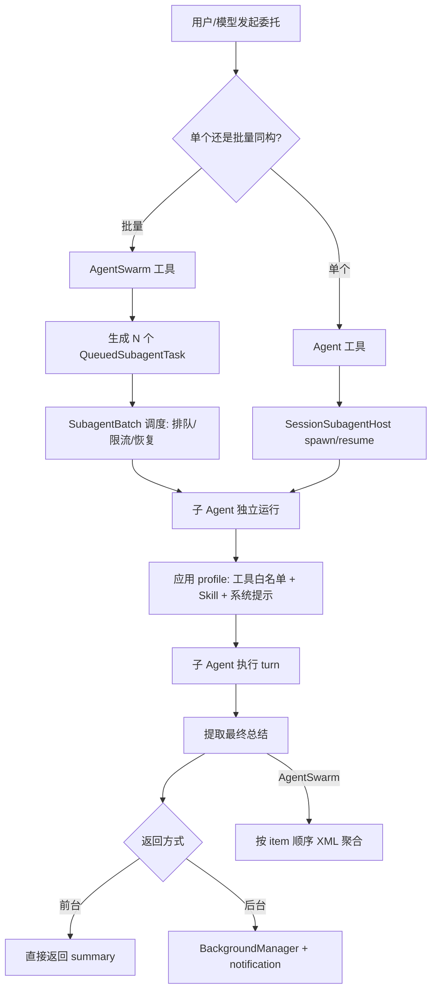
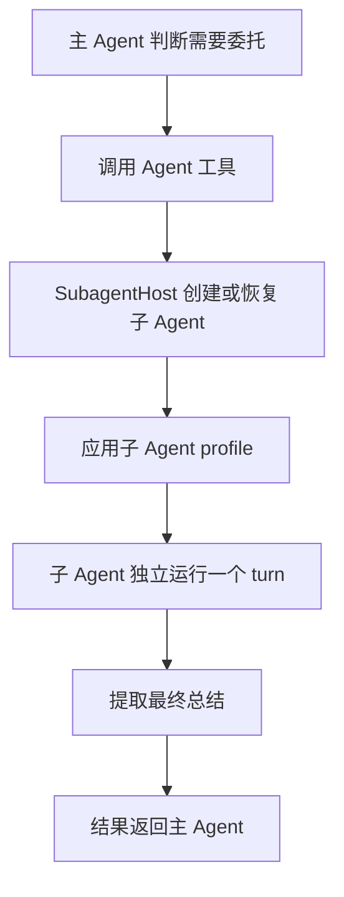
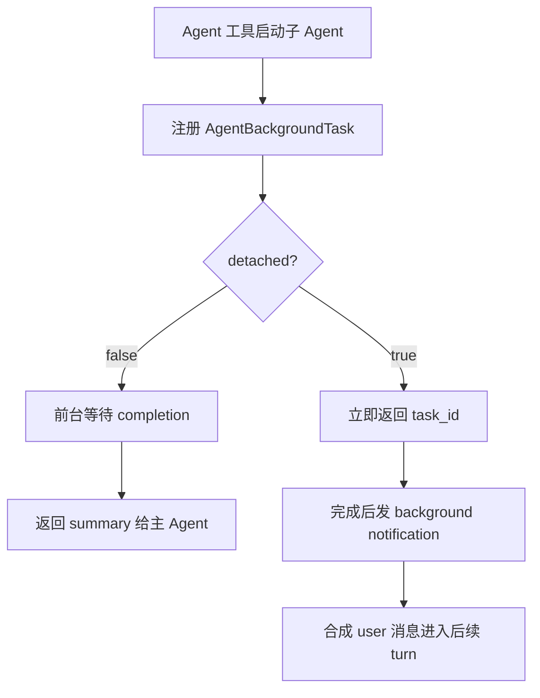

# 03. Subagent 与委托任务的设计与运行


> **文档同步跟踪**
> - 最后同步代码：`kimi-code` commit `c3a2ef0ce`（2026-08-27）
> - 同步方式：基于该文档撰写时的源码路径与提交记录梳理

本章解释 Kimi Code 如何通过 **Agent** 和 **AgentSwarm** 把独立工作封装成可调度、可恢复、可审计的子 Agent 生命周期。读完你会理解：子 Agent 有哪些预设角色、各角色能用什么工具、单次委托和批量委托分别走什么路径、Swarm 模式如何管理工具与 skill、以及 v2 做了哪些改变。



## 1. 设计目标

Subagent 体系围绕四个目标设计。

**第一，主上下文保持干净。**  
子 Agent 可以大量读文件、搜索、运行命令，但这些中间过程不会全部回灌到主 Agent。主 Agent 收到的是最后的总结，这能避免长会话被探索日志撑满。

**第二，任务可以自然并行。**  
如果用户让 Kimi 同时查三个主题，主 Agent 可以把三个主题拆成三个独立子任务。少量并行可以直接多次调用 `Agent`，模板一致的大批量并行则用 `AgentSwarm`。

**第三，能力边界由 profile 管。**  
不同子 Agent 不是不同类，而是不同 profile：`coder`、`explore`、`plan`。profile 决定系统提示和可用工具，形成“同一个 Agent 运行时，不同角色配置”的结构。

**第四，前台、后台、恢复共享同一套任务生命周期。**  
一个子 Agent 可以前台等待，也可以后台运行，还可以在失败、超时、重启后恢复。Kimi Code 没把这些场景分散实现，而是统一放进 background task 体系里。

## 2. 委托工具全景：Agent 与 AgentSwarm

`Agent` 和 `AgentSwarm` 解决的是不同粒度的问题。

| 工具 | 适合场景 | 输入形态 | 返回形态 |
|------|----------|----------|----------|
| `Agent` | 一个明确子任务，例如“用 explore 查一下认证模块怎么工作” | 一个完整 `prompt` + 一个 `description` | 一个子 Agent 的最终总结 |
| `AgentSwarm` | 同一模板套多个 item，例如“分别分析这 20 个文件” | `prompt_template` + `items` | 多个子 Agent 的聚合结果 |

两者都通过 `subagent_type` 指定子 Agent profile，省略时默认 `coder`。如果任务是“查 A、B、C 三个主题”：

- 三个主题要求差异大：并行调用多个 `Agent`。
- 三个主题要求完全一致：调用一个 `AgentSwarm`，把 A/B/C 放进 `items`。

关键取舍：`Agent` 提供灵活的一对一委托，`AgentSwarm` 提供结构化批量调度。

## 3. 子 Agent 的能力边界

### 3.1 预设子 Agent 与自定义扩展

Kimi Code 内置了三个可直接通过 `subagent_type` 使用的子 Agent profile，统一放在 `packages/agent-core/src/profile/default/*.yaml`：

| profile 名称 | 角色定位 | 默认模型偏好 | 关键约束 |
|-------------|---------|-------------|---------|
| `coder` | 通用工程子 Agent，唯一拥有文件编辑工具的子 Agent | secondary（实验开启时） | 可读写文件、运行命令、调度后台任务 |
| `explore` | 快速代码探索，系统提示强制只读 | secondary | 没有 Write/Edit，Bash 仅用于只读操作 |
| `plan` | 只读实现规划与架构设计 | secondary | 没有 Bash、Write/Edit、Skill、Cron |

这三个 profile 不是类，而是同一套 Agent 运行时的不同配置。主 Agent 的 `Agent` 工具描述会动态列出当前可委托的子 Agent 类型，这个列表来自父 profile 的 `subagents` 字段（见 `profile/agentfile/catalog.ts` 中的 `delegatableSubagents`）。

除了内置 trio，用户还可以通过 agent file 自定义子 Agent：

- 在 `.kimi/agents/`、项目根目录或 `--agent-dir` 指定目录下创建 `*.md` agent file；
- frontmatter 中声明 `name`、`tools`、`disallowedTools`、`subagents` 等字段；
- 自定义 profile 默认只能被主 Agent 委托，除非父 profile 的 `subagents` 白名单把它列出来；
- agent file 支持 `extends` 继承，因此可以基于 `coder` 或 `explore` 做微调。

### 3.2 各子 Agent 的工具清单

profile 的 `tools` 字段是白名单，`disallowedTools` 是黑名单；黑名单在白名单之上再过滤。子 Agent 创建时，`SessionSubagentHost.configureChild` 调用 `Agent.useProfile`，后者把 profile 的工具清单交给 `ToolManager.setActiveTools`，从而决定该子 Agent 能看到哪些工具。

| 工具 | `coder` | `explore` | `plan` |
|------|---------|-----------|---------|
| `Bash` | ✅ | ✅（仅只读操作） | ❌ |
| `Read` | ✅ | ✅ | ✅ |
| `ReadMediaFile` | ✅ | ✅ | ✅ |
| `Write` | ✅ | ❌ | ❌ |
| `Edit` | ✅ | ❌ | ❌ |
| `Glob` | ✅ | ✅ | ✅ |
| `Grep` | ✅ | ✅ | ✅ |
| `Skill` | ✅ | ❌ | ❌ |
| `WebSearch` | ✅ | ✅ | ✅ |
| `FetchURL` | ✅ | ✅ | ✅ |
| `TaskList` / `TaskOutput` / `TaskStop` | ✅ | ❌ | ❌ |
| `CronCreate` / `CronList` / `CronDelete` | ✅ | ❌ | ❌ |
| `TodoList` | ✅ | ❌ | ❌ |
| `EnterPlanMode` / `ExitPlanMode` | ✅ | ❌ | ❌ |
| `Agent`（v1） | ✅ | ❌ | ❌ |
| `AgentSwarm`（v1） | ✅ | ❌ | ❌ |
| `mcp__*` | ✅ | ❌ | ❌ |

几点关键说明：

- **工具白名单是硬性边界**：`explore` 和 `plan` 没有 Write/Edit，因此即使模型想写文件，工具层也会拒绝；这不是靠提示自律，而是 `loopTools` 根本不包含这些工具。
- **`explore` 的 Bash 只读约束**：`explore.yaml` 的 `roleAdditional` 明确告诉模型“Bash 只能用于 ls、git log、git diff、find 等只读操作”，而工具白名单本身无法阻止 `rm` 这类命令，因此这里存在“提示约束 + 权限审批”的双重保险。
- **`plan` 连 Bash 都没有**：规划任务只需要读和搜索，不需要执行命令或修改文件。
- **`coder` 拥有 `Skill` 工具**：因此工程子 Agent 也可以调用 skill，例如 `project-dissector`、`write-goal` 等；`explore` 和 `plan` 默认没有。
- **v1 与 v2 差异**：v1 的 `coder` 默认拥有 `Agent` 和 `AgentSwarm` 工具；v2 默认关闭子 Agent 再委托能力（详见 12.4）。

父 Agent 的自定义工具（user tools）和 MCP 工具会通过 `ToolManager.inheritUserTools` 被子 Agent 继承，但同样受子 Agent profile 的 `tools` / `disallowedTools` 过滤。也就是说，子 Agent 不是一张白纸，但它只能看到父 Agent 工具集中被 profile 允许的那一部分。

## 4. 单个 `Agent` 的生命周期

一次普通 `Agent` 委托可以拆成六个阶段。



### 4.1 创建或恢复

`Agent` 工具有两条路径：

- **spawn**：创建一个新的子 Agent。
- **resume**：恢复一个已有子 Agent，用于继续之前的任务或恢复失败任务。

这两个路径统一由 `SessionSubagentHost` 处理。host 负责检查父子关系、避免同一个子 Agent 并发运行、创建子 Agent 记录目录，并启动子 Agent 的 turn。

这种设计让“新建”和“继续”共享同一个运行模型。对主 Agent 来说，恢复一个子 Agent 不是读取一份旧报告，而是让同一个子 Agent 带着自己的历史继续工作。

### 4.2 应用 profile

profile 不是装饰性文本。`Agent.useProfile` 会做三件事：

1. 记录当前 profile；
2. 用该 profile 渲染系统提示（其中 `KIMI_SKILLS` 字段会带入当前可用 skill 列表）；
3. 调用 `ToolManager.setActiveTools` 应用工具白名单/黑名单。

也就是说，`explore` 不是靠“请不要写文件”自律，而是 `loopTools` 默认就没有写入类工具；`plan` 的工具集更窄，避免规划任务变成执行任务。

### 4.3 独立运行与汇总交接

子 Agent 有自己的上下文、工具管理器、turn flow、usage 统计和记录文件。主 Agent 给它的不是完整聊天历史，而是一段明确的任务 prompt。这带来两个后果：

1. 子 Agent 不知道主会话里没有显式交接给它的内容。
2. 主 Agent 不会看到子 Agent 的所有中间过程，只看到最终交接。

子 Agent 完成后，系统取它最后的 assistant 文本作为交接结果。如果这个总结过短，host 会让子 Agent 再补一次更完整的总结。Kimi Code 把子 Agent 的输出当成“可供父 Agent 继续工作的技术交接”，而不是把工具调用原始日志直接塞回主上下文。

## 5. `AgentSwarm` 与批量调度

`AgentSwarm` 是面向“大量同构子任务”的模型工具，但真正的批量调度由 `SubagentBatch` 完成。关系可以概括为：**`AgentSwarm` 负责“拆”，`SubagentBatch` 负责“控”**。

### 5.1 `AgentSwarm` 的输入形态

一次 `AgentSwarm` 调用通常包含：

- `description`：整个 swarm 的摘要。
- `subagent_type`：所有新建子 Agent 使用的 profile，默认 `coder`。
- `prompt_template`：子任务模板，必须包含 `{{item}}`。
- `items`：每个 item 替换进模板，生成一个子 Agent prompt。
- `resume_agent_ids`：可选，恢复已有子 Agent 并继续处理。

例如“同时查三个主题”可以抽象成：

```text
prompt_template = "请调研 {{item}}，总结关键事实、相关文件、风险和不确定点。"
items = ["主题 A", "主题 B", "主题 C"]
subagent_type = "explore"
```

`AgentSwarmTool` 会把每个 item 转换成一个 `QueuedSubagentTask`，然后交给 `SubagentBatch` 调度。最终结果按原始 item 顺序汇总成 XML：

```xml
<agent_swarm_result>
  <summary>completed: 3, failed: 0</summary>
  <subagent item="主题 A" outcome="completed">...</subagent>
  <subagent item="主题 B" outcome="completed">...</subagent>
  <subagent item="主题 C" outcome="completed">...</subagent>
</agent_swarm_result>
```

### 5.2 `SubagentBatch` 解决什么问题

如果只是在代码里 `Promise.all(items.map(spawn))`，会遇到几个问题：

- 一下子启动太多子 Agent，provider 容易限流。
- 某个子 Agent 限流时，不能让整个批次永久卡住。
- 用户中断时，需要区分已完成、已启动但中断、还没启动。
- 批量结果需要按输入顺序返回，方便主 Agent 对齐 item。

`SubagentBatch` 的调度策略大致是：

1. 正常阶段先启动一批子 Agent。
2. 后续按节奏继续放量，而不是瞬间打满。
3. 如果 provider rate limit，进入限流恢复阶段。
4. 限流时优先复用已创建的子 Agent，通过 retry/resume 延续上下文。
5. 所有结果按原始 item 顺序汇总。

这让 `AgentSwarm` 更像一个“受控批处理系统”，而不是一次性并发请求。从代码路径看：

```text
AgentSwarmTool.execution
  -> SessionSubagentHost.runQueued(tasks)
     -> new SubagentBatch(host, tasks, { maxConcurrency }).run()
        -> 对每个 task 调用 host.spawn / host.resume / host.retry
```

## 6. 前台、后台与恢复

`Agent` 支持两种运行方式：

- **前台**：父 Agent 等子 Agent 完成后再继续。
- **后台**：工具立即返回，子 Agent 继续跑，完成后自动把通知送回主 Agent。

表面看这是 `run_in_background` 一个布尔参数，实际设计更深：前台和后台子 Agent 都会注册到 `BackgroundManager`，区别只是任务是否 detached。



这样做有几个好处：

- 前台任务可以被用户 Ctrl+B 移到后台。
- 前台和后台共享超时、停止、输出保存逻辑。
- 后台任务完成、失败、超时、丢失都能通过同一套通知机制回到主 Agent。
- 重启后能把之前 running 的后台任务标记为 lost，并给出恢复提示。

这里有一个关键概念：后台子 Agent 有两类 id。

| id | 用途 |
|----|------|
| `task_id` | 管后台任务，用于 `TaskList`、`TaskOutput`、`TaskStop` |
| `agent_id` | 管子 Agent 实例，用于 `Agent(resume=...)` |

这两个 id 不能混用。`task_id` 是任务壳，`agent_id` 才是可以恢复上下文的子 Agent。

## 7. Swarm 模式下的工具与 Skill 管理

`swarmMode` 不是实际执行 swarm 的地方，它是一个轻量状态机，用来引导模型进入“先拆分、再委托、少自己做主体工作”的模式。

### 7.1 SwarmMode 状态机

三种触发来源：

- `manual`：用户显式进入 swarm mode（`/swarm on`）。
- `task`：一次性 swarm prompt（`/swarm <prompt>`）。
- `tool`：模型调用 `AgentSwarm` 时进入。

当触发源是用户或任务时，系统会向上下文注入 workflow 提醒：先做必要探索，再决定如何拆分，再用 `AgentSwarm` 分派。当触发源是 `tool` 时，不再重复注入，因为模型已经做出了调用 `AgentSwarm` 的动作。

`AgentSwarm` 必须单独出现在一次模型响应里，不能和其他工具混用，也不能同一响应里发多个 `AgentSwarm`。`AgentSwarmTool.resolveExecution` 把 `approvalRule` 设为自己，权限策略 `agent-swarm-exclusive-deny.ts` 会拒绝同批次的其他工具调用。这个限制降低了调度、权限审批和 UI 结果归属的复杂度。

### 7.2 Swarm 中的工具与 Skill 继承

SwarmMode 本身只控制系统提示注入，**不**增减工具。每个 swarm 成员仍然走 `SessionSubagentHost.spawn`，独立应用 `subagent_type` 指定的 profile，因此每个成员的工具边界完全由该 profile 决定。

Skill 的继承与隔离规则如下：

- 子 Agent 的系统提示由 `Agent.updateSystemPromptFromProfile` 渲染，其中 `skills: this.skills?.registry` 被传入渲染上下文；只要父 Agent 的 skill 列表非空，并且当前 profile 的 `tools` 白名单包含 `Skill`，子 Agent 就能看到与父 Agent 相同的可用 skill 列表。
- 子 Agent 拥有独立的 `SkillManager` 和 `ToolManager`：技能激活记录（`skill.activated` 事件）写入子 Agent 自己的 transcript；`Skill` 工具调用时读取的是子 Agent 自己的 `SkillManager.registry`。
- 子 Agent 退出后，skill 调用历史不会自动回流到父 Agent，只有最终总结才会交接。因此 swarm 中的每个成员可以独立调用 skill，但父 Agent 只拿到聚合后的最终文本结果。

> **内置 skill 一览（v1）**
>
> `packages/agent-core/src/skill/builtin/index.ts` 注册到会话 skill registry 的内置 skill 包括：
>
> - `mcp-config`：配置/管理 MCP server。
> - `import-from-cc-codex`：从 Claude Code 的 codex 导入上下文。
> - `update-config`：更新 Kimi Code 配置。
> - `custom-theme`：自定义 TUI 主题。
> - `write-goal`：把用户意图写成结构化 goal。
> - `check-kimi-code-docs`：检查 Kimi Code 文档一致性。
> - `sub-skill` / `review` / `consolidate`：skill 分组管理（默认 `disable-model-invocation`，主要由用户通过 slash 命令触发）。
>
> 这些 skill 在子 Agent 中能否调用，取决于两点：该 Agent 的 profile 工具白名单包含 `Skill`；以及 skill 本身未被标记为 `disableModelInvocation`。模型通过 `Skill` 工具按名称调用时，`SkillTool` 会检查递归深度（`MAX_SKILL_QUERY_DEPTH`），防止 skill 无限套娃。

### 7.3 子 Agent 的再委托限制

v1 的 `coder` profile 默认拥有 `Agent` 和 `AgentSwarm` 工具，因此 v1 的子 Agent 理论上可以继续 spawn 子子 Agent。v2 改了默认行为（#3012）：

- 子 Agent 默认**不能**再创建自己的子 Agent，防止无限嵌套；
- 如果某个自定义 agent profile 明确允许，仍可开启。

这个改动让委托树的深度变得可控，避免模型在子 Agent 里继续无节制地 spawn。

## 8. 权限边界

Subagent 的安全边界不是单层的。

**第一层：profile 工具白名单。**  
`coder`、`explore`、`plan` 的工具集不同。能力边界先由 profile 收窄，其机制是 `Agent.useProfile` → `ToolManager.setActiveTools(profile.tools, profile.disallowedTools)`。

**第二层：父 Agent 权限规则。**  
子 Agent 会继承父 Agent 的用户工具和部分权限语义。用户设置过的规则不会因为派发子 Agent 就失效。

**第三层：工具级审批。**  
`Agent` 本身默认可放行，因为它只是启动委托；子 Agent 内部具体做写文件、跑命令等操作时，仍要经过对应工具和权限策略。

**第四层：批量工具约束。**  
`AgentSwarm` 有独占调用规则，避免模型在同一步里同时启动多个复杂批处理或混入其他工具。

这套组合让系统可以鼓励模型大胆并行，同时不把并行委托变成绕过权限的后门。

## 9. UI 如何呈现子 Agent

Core 发出的是事件，TUI 不重新实现子 Agent 语义。

核心事件包括：

- `subagent.spawned`
- `subagent.started`
- `subagent.suspended`
- `subagent.completed`
- `subagent.failed`
- `background.task.started`
- `background.task.terminated`

TUI 根据事件更新三类界面：

| 场景 | UI 表现 |
|------|---------|
| 单个前台 `Agent` | 一个 Agent 工具卡，显示 queued/running/done/failed |
| 同一步多个前台 `Agent` | 合并成 agent group，例如 “Running 3 agents” |
| `AgentSwarm` | 显示 swarm progress 面板，按成员追踪启动、运行、挂起、完成、失败 |
| 后台 Agent | transcript 里出现后台 agent started/completed/failed 状态，并通过任务列表可查看 |

这个分层很清楚：core 决定生命周期，protocol 传事件，TUI 只负责可视化。

## 10. 关键实现入口

正文里不逐行展开源码，关键入口集中在这里：

| 责任 | 主要文件 |
|------|----------|
| 单个委托工具 | `packages/agent-core/src/tools/builtin/collaboration/agent.ts` |
| 批量委托工具 | `packages/agent-core/src/tools/builtin/collaboration/agent-swarm.ts` |
| 子 Agent 创建、恢复、运行 | `packages/agent-core/src/session/subagent-host.ts` |
| swarm 批调度、限流恢复 | `packages/agent-core/src/session/subagent-batch.ts` |
| 子 Agent profile 解析 | `packages/agent-core/src/profile/resolve.ts` |
| profile/agent file 目录加载 | `packages/agent-core/src/profile/agentfile/catalog.ts` |
| 子 Agent profile YAML | `packages/agent-core/src/profile/default/*.yaml` |
| 工具白名单/黑名单应用 | `packages/agent-core/src/agent/tool/index.ts`（`setActiveTools`） |
| skill 激活与注册 | `packages/agent-core/src/agent/skill/index.ts`、`packages/agent-core/src/skill/registry.ts` |
| 前台/后台任务生命周期 | `packages/agent-core/src/agent/background/` |
| swarm mode 状态 | `packages/agent-core/src/agent/swarm/index.ts` |
| swarm 独占权限策略 | `packages/agent-core/src/agent/permission/policies/agent-swarm-exclusive-deny.ts` |
| 生命周期事件协议 | `packages/protocol/src/events.ts` |
| TUI 子 Agent 展示 | `apps/kimi-code/src/tui/controllers/subagent-event-handler.ts` |

## 11. 设计取舍

**为什么不是让主 Agent 自己并行调用搜索工具？**  
简单搜索可以直接并行调用 `Grep`、`Read`、`WebSearch`。但当每个主题都需要多步探索、判断和总结时，子 Agent 更合适，因为它能把探索上下文封装起来。

**为什么前台也走 BackgroundManager？**  
因为前台任务也可能被 detach 成后台任务，也需要超时、停止、输出保存和终态同步。统一任务生命周期比为前台和后台各写一套逻辑更稳。

**为什么只把最终总结交回主 Agent？**  
委托的核心价值是节省主上下文。如果所有中间过程都回灌，主 Agent 仍然会被大量噪声污染。

**为什么需要 `AgentSwarm`，不能只多次调用 `Agent`？**  
少量异构任务用多个 `Agent` 足够。大量同构任务需要模板化、排队、限流恢复、有序聚合，这就是 `AgentSwarm` + `SubagentBatch` 的价值。

**为什么 `AgentSwarm` 要独占一次模型响应？**  
如果 `AgentSwarm` 和其他工具混在一起，权限审批需要判断“部分批准/拒绝”，UI 也要把同一响应中的其他工具结果与 swarm 结果分开归属。独占调用把调度、权限、UI 都简化成单一入口。

**为什么用 profile 而不是子类？**  
子 Agent 之间共享同一套 Agent runtime，差异主要是角色提示和工具集。用 profile 表达差异，比为每种子 Agent 复制一套执行器更轻，也更容易扩展。

**为什么 explore/plan 的只读不能仅靠提示？**  
提示可以建议模型不要写文件，但无法阻止工具误用或幻觉调用。把 Write/Edit 从工具表里移除，是从执行层面消除写操作路径，与提示约束形成纵深防御。

## 12. v2 视角：Subagent 模型的变化

2026 年 7 月后的 v2 引擎（`packages/agent-core-v2`）保留了 `Agent` / `AgentSwarm` 的模型层语义，但运行调度层被重新组织进 DI × Scope 架构。

### 12.1 运行调度层换了实现

v1 的 `SessionSubagentHost`、`SubagentBatch`、`BackgroundManager` 是对象方法组合；v2 里对应的概念被拆成 Feature 和 Agent-scope Service：

- `features/swarm/` —— 对应 `AgentSwarm` 批量调度；
- `features/goal/` —— 对应自主目标执行；
- `features/tower/` —— 新的 Tower 模式。

v2 的每个子 Agent 是一个独立的 **Agent Scope**，有自己的 loop、tool executor、state dispatcher，生命周期由 `IAgentLifecycleService` 管理。详见 [07. agent-core-v2 与 kap-server 新架构](07-agent-core-v2.md)。

### 12.2 `WaitFor` 工具

v2 新增了 `WaitFor` 工具（CHANGELOG 0.38.0，commit 相关 #3060）：

- 允许 agent **在当前 turn 内等待一个后台任务完成**，而不是结束 turn、等任务通知触发下一轮。
- 解决了“后台任务还没跑完，主 Agent 就过早继续”的问题。
- 对 print mode（`kimi -p`）尤其重要：它让 headless 运行可以同步等待子 Agent。

源码入口：`packages/agent-core-v2/src/features/task/`。

### 12.3 Tower 模式

Tower 是 v2 里一个实验性 Feature（通过 flag 开启），用于把复杂的多步任务组织成受控的 worker 模式。关键变化：

- Tower 移除了“command queue”（commit #3193 `fix(tower): remove command queue`），不再用队列派发命令，而是走更直接的 runtime 绑定。
- 有专门的 `tower-worker` profile 和 eleven `Tower*` 工具。
- Tower 的 orchestration manual 通过 reminder injection 注入。

源码入口：`packages/agent-core-v2/src/features/tower/`。

### 12.4 子 Agent 默认不再创建子 Agent

v2 改了默认行为（#3012）：

- 子 Agent 默认**不能**再创建自己的子 Agent，防止无限嵌套；
- 如果某个自定义 agent profile 明确允许，仍可开启。

这个改动让委托树的深度变得可控。v1 的 `coder` 默认拥有 `Agent` / `AgentSwarm` 工具，而 v2 的默认 profile 把再委托能力关掉，只有在显式声明时才恢复。

### 12.5 Background / foreground 的展示改名

v2 的 Web UI 把“Subagent panel”改名为 **Background Agent panel**，并修复了多个前台/后台任务归属问题：

- 前台 subagent 不再错误地出现在 Background Agent panel；
- 后台任务可取消的时间窗口修复；
- 取消或异常结束的后台任务不再显示为已完成。

### 12.6 读 v2 代码的入口

| 主题 | v2 入口 |
|---|---|
| Agent 生命周期 | `packages/agent-core-v2/src/session/agentLifecycle/agentLifecycleService.ts` |
| Swarm Feature | `packages/agent-core-v2/src/features/swarm/` |
| Goal Feature | `packages/agent-core-v2/src/features/goal/` |
| Tower Feature | `packages/agent-core-v2/src/features/tower/` |
| Task / WaitFor | `packages/agent-core-v2/src/features/task/` |
| 子 Agent profile catalog | `packages/agent-core-v2/src/app/agentProfileCatalog/` |

## 13. 小结

Kimi Code 的委托体系可以概括成三层：

```text
模型工具层：Agent / AgentSwarm
运行调度层：SessionSubagentHost / SubagentBatch / BackgroundManager
能力边界层：profile / permission / UI events
```

当任务适合并行时，主 Agent 会选择把工作拆给子 Agent：

- 一个或几个差异化子任务：用多个 `Agent`。
- 很多同构子任务：用 `AgentSwarm`。
- 子任务需要只读探索：通常选 `subagent_type="explore"`。
- 子任务需要实际改代码：通常选 `subagent_type="coder"`。
- 子任务只是设计方案：通常选 `subagent_type="plan"`。

这套设计的本质不是“让模型更热闹地并发”，而是把独立工作封装成可调度、可恢复、可审计、可汇总的子 Agent 生命周期。
