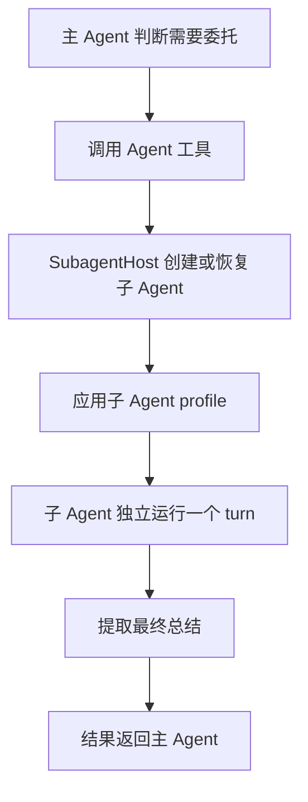
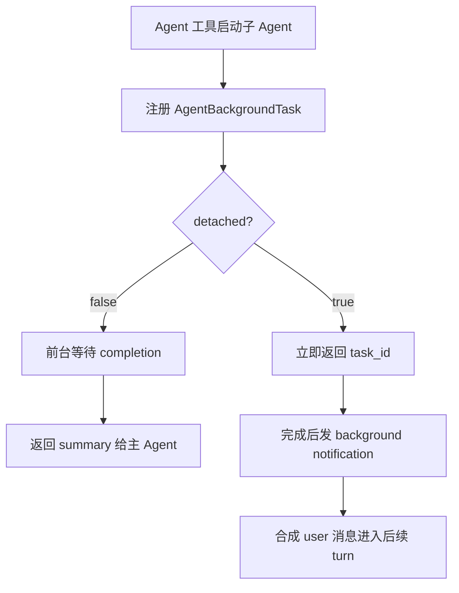

# 03. Subagent 与委托任务的设计与运行

Subagent 不是“多开几个模型请求”这么简单。它是 Kimi Code 用来解决两个工程问题的机制：

1. **并行化独立工作**：例如同时调查三个主题、同时审阅多处改动、同时让多个 agent 分别处理一批文件。
2. **隔离上下文噪声**：把探索过程、长输出、中间工具调用留在子 Agent 自己的上下文里，主 Agent 只拿最终结论。

Kimi Code 里真正暴露给模型的委托能力主要是两个工具：

- `Agent`：派发一个子 Agent 做一个子任务。
- `AgentSwarm`：按同一模板批量派发多个子 Agent。

它们背后的运行时由 `SessionSubagentHost`、`SubagentBatch`、`BackgroundManager`、profile 和 TUI 事件系统共同支撑。

## 1. 设计目标

Subagent 体系围绕四个目标设计。

**第一，主上下文保持干净。**  
子 Agent 可以大量读文件、搜索、运行命令，但这些中间过程不会全部回灌到主 Agent。主 Agent 收到的是最后的总结，这能避免长会话被探索日志撑满。

**第二，任务可以自然并行。**  
如果用户让 Kimi 同时查三个主题，主 Agent 可以把三个主题拆成三个独立子任务。少量并行可以直接多次调用 `Agent`，模板一致的大批量并行则用 `AgentSwarm`。

**第三，能力边界由 profile 管。**  
不同子 Agent 不是不同类，而是不同 profile：`coder`、`explore`、`plan`。profile 决定系统提示和可用工具，形成“同一个 Agent 运行时，不同角色配置”的结构。

**第四，前台、后台、恢复共享同一套任务生命周期。**  
一个子 Agent 可以前台等待，也可以后台运行，还可以在失败、超时、重启后恢复。Kimi Code 没把这些场景分散实现，而是统一放进 background task 体系里。

## 2. 两种委托工具

`Agent` 和 `AgentSwarm` 解决的是不同粒度的问题。

| 工具 | 适合场景 | 输入形态 | 返回形态 |
|------|----------|----------|----------|
| `Agent` | 一个明确子任务，例如“用 explore 查一下认证模块怎么工作” | 一个完整 `prompt` + 一个 `description` | 一个子 Agent 的最终总结 |
| `AgentSwarm` | 同一模板套多个 item，例如“分别分析这 20 个文件” | `prompt_template` + `items` | 多个子 Agent 的聚合结果 |

如果任务是“查 A、B、C 三个主题”，两种方式都可行：

- 三个主题要求差异大：主 Agent 更可能并行调用多个 `Agent`。
- 三个主题要求完全一致：主 Agent 更适合调用一个 `AgentSwarm`，把 A/B/C 放进 `items`。

这也是这个设计的关键取舍：`Agent` 提供灵活的一对一委托，`AgentSwarm` 提供结构化批量调度。

## 3. 单个 `Agent` 的生命周期

一次普通 `Agent` 委托可以拆成六个阶段。



### 3.1 创建或恢复

`Agent` 工具有两条路径：

- **spawn**：创建一个新的子 Agent。
- **resume**：恢复一个已有子 Agent，用于继续之前的任务或恢复失败任务。

这两个路径统一由 `SessionSubagentHost` 处理。host 负责检查父子关系、避免同一个子 Agent 并发运行、创建子 Agent 记录目录，并启动子 Agent 的 turn。

这种设计让“新建”和“继续”共享同一个运行模型。对主 Agent 来说，恢复一个子 Agent 不是读取一份旧报告，而是让同一个子 Agent 带着自己的历史继续工作。

### 3.2 应用 profile

子 Agent 创建后不会直接复用主 Agent 的完整配置，而是应用自己的 profile：

- `coder`：通用工程子 Agent，可以读写文件、执行命令、搜索代码。
- `explore`：探索型子 Agent，偏只读，适合查代码结构和回答实现问题。
- `plan`：规划型子 Agent，专注方案设计，不做实际修改。

profile 不是装饰性文本，它会决定 active tools。也就是说，`explore` 不是靠“请不要写文件”自律，而是默认就没有写入类工具；`plan` 的工具集更窄，避免规划任务变成执行任务。

### 3.3 独立运行

子 Agent 有自己的上下文、工具管理器、turn flow、usage 统计和记录文件。主 Agent 给它的不是完整聊天历史，而是一段明确的任务 prompt。

这会带来两个后果：

1. 子 Agent 不知道主会话里没有显式交接给它的内容。
2. 主 Agent 不会看到子 Agent 的所有中间过程，只看到最终交接。

所以 `Agent` 工具描述会要求主 Agent 像给同事交接任务一样写 prompt：目标是什么、已知事实是什么、具体路径或命令是什么、预期输出是什么。

### 3.4 汇总交接

子 Agent 完成后，系统取它最后的 assistant 文本作为交接结果。如果这个总结过短，host 会让子 Agent 再补一次更完整的总结。

这个细节很重要：Kimi Code 把子 Agent 的输出当成“可供父 Agent 继续工作的技术交接”，而不是把工具调用原始日志直接塞回主上下文。

## 4. 前台、后台与恢复

`Agent` 支持两种运行方式：

- **前台**：父 Agent 等子 Agent 完成后再继续。
- **后台**：工具立即返回，子 Agent 继续跑，完成后自动把通知送回主 Agent。

表面看这是 `run_in_background` 一个布尔参数，实际设计更深：前台和后台子 Agent 都会注册到 `BackgroundManager`，区别只是任务是否 detached。



这样做有几个好处：

- 前台任务可以被用户 Ctrl+B 移到后台。
- 前台和后台共享超时、停止、输出保存逻辑。
- 后台任务完成、失败、超时、丢失都能通过同一套通知机制回到主 Agent。
- 重启后能把之前 running 的后台任务标记为 lost，并给出恢复提示。

这里有一个关键概念：后台子 Agent 有两类 id。

| id | 用途 |
|----|------|
| `task_id` | 管后台任务，用于 `TaskList`、`TaskOutput`、`TaskStop` |
| `agent_id` | 管子 Agent 实例，用于 `Agent(resume=...)` |

这两个 id 不能混用。`task_id` 是任务壳，`agent_id` 才是可以恢复上下文的子 Agent。

## 5. `AgentSwarm` 的批量调度

`AgentSwarm` 是面向“大量同构子任务”的工具。它不是简单 for 循环，而是一个批处理调度器。

一次 swarm 调用通常包含：

- `description`：整个 swarm 的摘要。
- `subagent_type`：所有新建子 Agent 使用的 profile，默认 `coder`。
- `prompt_template`：子任务模板，必须包含 `{{item}}`。
- `items`：每个 item 替换进模板，生成一个子 Agent prompt。
- `resume_agent_ids`：可选，恢复已有子 Agent 并继续处理。

例如“同时查三个主题”可以抽象成：

```text
prompt_template = "请调研 {{item}}，总结关键事实、相关文件、风险和不确定点。"
items = ["主题 A", "主题 B", "主题 C"]
subagent_type = "explore"
```

运行时会把它变成三个 queued subagent task，然后交给 `SubagentBatch` 调度。

## 6. `SubagentBatch` 解决什么问题

如果只是在代码里 `Promise.all(items.map(spawn))`，会遇到几个问题：

- 一下子启动太多子 Agent，provider 容易限流。
- 某个子 Agent 限流时，不能让整个批次永久卡住。
- 用户中断时，需要区分已完成、已启动但中断、还没启动。
- 批量结果需要按输入顺序返回，方便主 Agent 对齐 item。

`SubagentBatch` 就是为这些问题存在的。它的调度策略大致是：

1. 正常阶段先启动一批子 Agent。
2. 后续按节奏继续放量，而不是瞬间打满。
3. 如果 provider rate limit，进入限流恢复阶段。
4. 限流时优先复用已创建的子 Agent，通过 retry/resume 延续上下文。
5. 所有结果按原始 item 顺序汇总。

这让 `AgentSwarm` 更像一个“受控批处理系统”，而不是一次性并发请求。

## 7. Swarm Mode 的作用

`swarmMode` 不是实际执行 swarm 的地方，它是一个轻量状态机，用来引导模型进入“先拆分、再委托、少自己做主体工作”的模式。

它有三种触发来源：

- `manual`：用户显式进入 swarm mode。
- `task`：一次性 swarm prompt。
- `tool`：模型调用 `AgentSwarm` 时进入。

当 swarm mode 是用户或任务触发时，系统会向上下文注入 workflow 提醒：先做必要探索，再决定如何拆分，再用 `AgentSwarm` 分派。  
当触发源是 `tool` 时，不再重复注入，因为模型已经做出了调用 `AgentSwarm` 的动作。

权限上还有一个重要约束：`AgentSwarm` 必须单独出现在一次模型响应里，不能和其他工具混用，也不能同一响应里发多个 `AgentSwarm`。这个限制看起来严格，但它降低了调度、权限审批和 UI 结果归属的复杂度。

## 8. 权限与工具边界

Subagent 的安全边界不是单层的。

**第一层：profile 工具白名单。**  
`coder`、`explore`、`plan` 的工具集不同。能力边界先由 profile 收窄。

**第二层：父 Agent 权限规则。**  
子 Agent 会继承父 Agent 的用户工具和部分权限语义。用户设置过的规则不会因为派发子 Agent 就失效。

**第三层：工具级审批。**  
`Agent` 本身默认可放行，因为它只是启动委托；子 Agent 内部具体做写文件、跑命令等操作时，仍要经过对应工具和权限策略。

**第四层：批量工具约束。**  
`AgentSwarm` 有独占调用规则，避免模型在同一步里同时启动多个复杂批处理或混入其他工具。

这套组合让系统可以鼓励模型大胆并行，同时不把并行委托变成绕过权限的后门。

## 9. UI 如何呈现子 Agent

Core 发出的是事件，TUI 不重新实现子 Agent 语义。

核心事件包括：

- `subagent.spawned`
- `subagent.started`
- `subagent.suspended`
- `subagent.completed`
- `subagent.failed`
- `background.task.started`
- `background.task.terminated`

TUI 根据事件更新三类界面：

| 场景 | UI 表现 |
|------|---------|
| 单个前台 `Agent` | 一个 Agent 工具卡，显示 queued/running/done/failed |
| 同一步多个前台 `Agent` | 合并成 agent group，例如 “Running 3 agents” |
| `AgentSwarm` | 显示 swarm progress 面板，按成员追踪启动、运行、挂起、完成、失败 |
| 后台 Agent | transcript 里出现后台 agent started/completed/failed 状态，并通过任务列表可查看 |

这个分层很清楚：core 决定生命周期，protocol 传事件，TUI 只负责可视化。

## 10. 关键实现入口

正文里不逐行展开源码，关键入口集中在这里：

| 责任 | 主要文件 |
|------|----------|
| 单个委托工具 | `packages/agent-core/src/tools/builtin/collaboration/agent.ts` |
| 批量委托工具 | `packages/agent-core/src/tools/builtin/collaboration/agent-swarm.ts` |
| 子 Agent 创建、恢复、运行 | `packages/agent-core/src/session/subagent-host.ts` |
| swarm 批调度、限流恢复 | `packages/agent-core/src/session/subagent-batch.ts` |
| 子 Agent profile | `packages/agent-core/src/profile/default/*.yaml` |
| 前台/后台任务生命周期 | `packages/agent-core/src/agent/background/` |
| swarm mode 状态 | `packages/agent-core/src/agent/swarm/index.ts` |
| 生命周期事件协议 | `packages/protocol/src/events.ts` |
| TUI 子 Agent 展示 | `apps/kimi-code/src/tui/controllers/subagent-event-handler.ts` |

## 11. 设计取舍

**为什么不是让主 Agent 自己并行调用搜索工具？**  
简单搜索可以直接并行调用 `Grep`、`Read`、`WebSearch`。但当每个主题都需要多步探索、判断和总结时，子 Agent 更合适，因为它能把探索上下文封装起来。

**为什么前台也走 BackgroundManager？**  
因为前台任务也可能被 detach 成后台任务，也需要超时、停止、输出保存和终态同步。统一任务生命周期比为前台和后台各写一套逻辑更稳。

**为什么只把最终总结交回主 Agent？**  
委托的核心价值是节省主上下文。如果所有中间过程都回灌，主 Agent 仍然会被大量噪声污染。

**为什么需要 `AgentSwarm`，不能只多次调用 `Agent`？**  
少量异构任务用多个 `Agent` 足够。大量同构任务需要模板化、排队、限流恢复、有序聚合，这就是 `AgentSwarm` 的价值。

**为什么用 profile 而不是子类？**  
子 Agent 之间共享同一套 Agent runtime，差异主要是角色提示和工具集。用 profile 表达差异，比为每种子 Agent 复制一套执行器更轻，也更容易扩展。

## 12. 小结

Kimi Code 的委托体系可以概括成三层：

```text
模型工具层：Agent / AgentSwarm
运行调度层：SessionSubagentHost / SubagentBatch / BackgroundManager
能力边界层：profile / permission / UI events
```

当任务适合并行时，主 Agent 会选择把工作拆给子 Agent：

- 一个或几个差异化子任务：用多个 `Agent`。
- 很多同构子任务：用 `AgentSwarm`。
- 子任务需要只读探索：通常选 `subagent_type="explore"`。
- 子任务需要实际改代码：通常选 `subagent_type="coder"`。
- 子任务只是设计方案：通常选 `subagent_type="plan"`。

这套设计的本质不是“让模型更热闹地并发”，而是把独立工作封装成可调度、可恢复、可审计、可汇总的子 Agent 生命周期。
