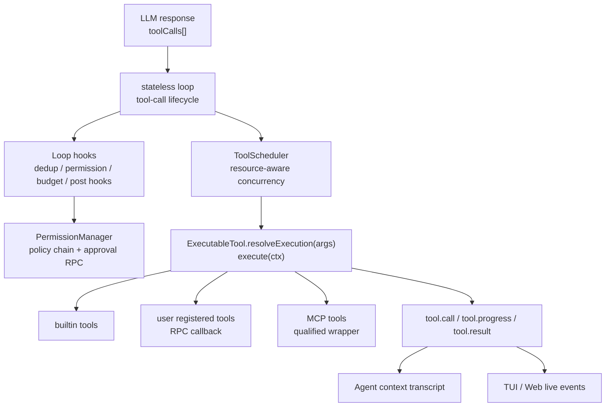

# 第 4 章：Tool 系统与执行 Harness

> **文档同步跟踪**
> - 最后同步代码：`kimi-code` commit `c3a2ef0ce`（2026-08-27）
> - 同步方式：基于该文档撰写时的源码路径与提交记录梳理

> 本章导读：本章拆 Kimi Code 中 tool 的来源、注册、执行、权限和并发模型。读完后应该能回答三个问题：里面有哪些 tool；tool 调用从模型响应到 transcript 落盘经历哪些边界；普通多 tool 调用和 AgentSwarm 批量调用分别怎样并行。

## 4.1 这个系统解决什么问题

Tool 系统把“模型想做事”变成“宿主可审计、可审批、可取消、可恢复的副作用”。核心不是某个 `Read` 或 `Bash` 的实现，而是三层分工：

设计上它刻意把“模型协议”和“宿主副作用”隔开：

- `loop` 是无状态执行器：只认识 `ExecutableTool[]`、hooks、事件分发器和 abort signal。
- `ToolManager` 负责把 builtin/user/MCP 三类工具汇成当前 Agent 可见的 `loopTools`。
- `TurnFlow.runStepLoop` 是真正的 tool harness：它把上下文构建、MCP 初始加载、compaction/injection、重复调用抑制、权限审批、hook 和结果预算接到无状态 loop 上。
- `KimiHarness` 位于 Node SDK 层，负责会话生命周期和 RPC facade；它不是 tool 执行 harness，只是让外部宿主创建/恢复 Session、设置 approval/question handler、发 prompt。

## 4.2 Tool 清单：包含哪些 tool

内置 tool 的导出入口是 `packages/agent-core/src/tools/builtin/index.ts`。实际注册时，`ToolManager.initializeBuiltinTools()` 会按模型能力、RPC 能力、cron/skill/subagent 服务是否存在做条件装配。

| 类别 | Tool | 是否总是出现 | 角色 |
| --- | --- | --- | --- |
| 文件 | `Read`, `Write`, `Edit`, `Grep`, `Glob` | 有 provider 时注册 | 读写和搜索 workspace 文件 |
| 多模态 | `ReadMediaFile` | 仅模型支持 `image_in` 或 `video_in` | 读取图片/视频并作为内容块返回 |
| Shell | `Bash` | 有 provider 时注册 | 前台/后台执行命令 |
| Plan | `EnterPlanMode`, `ExitPlanMode` | 有 provider 时注册 | 进入/退出 Plan Mode，和审批策略联动 |
| Goal | `CreateGoal`, `GetGoal`, `SetGoalBudget`, `UpdateGoal` | 仅 main agent 注册；其中 mutation tool 在无 goal 时不会暴露给模型 | 管理自动目标循环 |
| 状态 | `TodoList` | 有 provider 时注册 | 保存当前 Agent 的 todo 状态 |
| 后台任务 | `TaskList`, `TaskOutput`, `TaskStop` | 有 provider 时注册 | 管理由 `Bash`、`Agent`、`AskUserQuestion` 派生的后台任务 |
| 定时任务 | `CronCreate`, `CronList`, `CronDelete` | 仅 session 有 cron 服务 | 将未来 prompt 注入当前会话 |
| 协作 | `Agent`, `AgentSwarm` | 仅有 subagentHost | 派生/恢复子 Agent，或批量运行子 Agent |
| 用户交互 | `AskUserQuestion` | 仅 RPC 提供 `requestQuestion` | 结构化向用户提问，可后台化 |
| Skill | `Skill` | 仅存在可调用 inline skill | 调用 inline skill，带嵌套深度限制 |
| Web | `WebSearch`, `FetchURL` | 仅注入对应 provider 服务 | 搜索网页和抓取 URL |

除内置工具外，还有两类动态 tool：

- **User tool**：通过 `ToolManager.registerUserTool()` 注册，执行时回调 `agent.rpc.toolCall()`。它用于宿主/协议侧临时注入工具，子 Agent 可以继承父 Agent 当前激活的 user tools。
- **MCP tool**：`McpConnectionManager` 发现 server 的工具后，`ToolManager.registerMcpServer()` 包装成 `mcp__server__tool` 形式的 `ExecutableTool`。MCP 的 enabled/disabled 过滤在连接管理器里先算出，Agent profile 侧再用 `mcp__*` 这类 glob pattern 决定是否暴露。

`ToolManager.loopTools` 是给模型的最终工具列表：先取 active builtin/user tool 名，再展开匹配的 MCP tool，排序、去重、隐藏当前不应出现的 goal mutation tool，最后映射到 `ExecutableTool` 实例。

## 4.3 Tool 的核心接口

Kimi Code 没有把 tool 设计成“直接执行函数”。每个工具先实现 `resolveExecution(input)`，返回一次具体调用的执行计划：

| 字段 | 含义 |
| --- | --- |
| `approvalRule` | 权限规则匹配对象，例如 `Bash(command)`、`Write(path)` 或工具名 |
| `matchesRule` | 可选的自定义规则匹配，例如 `Agent` 可以按 subagent profile 匹配 |
| `description` | 给 UI 和审批面板看的动作摘要 |
| `display` | 结构化审批/展示数据，例如文件 diff、shell command、plan review、agent call |
| `accesses` | 资源访问声明，用于同一步工具调用并行调度 |
| `stopBatchAfterThis` | 成功后跳过同一批后续工具调用，适合改变 turn 生命周期的工具 |
| `execute(ctx)` | 真正执行副作用，接收 `turnId`、`toolCallId`、`AbortSignal` 和 `onUpdate` |

这个“两段式”很关键：权限审批发生在 `resolveExecution` 之后、`execute` 之前。也就是说，工具可以先把输入规范化为可展示、可审批、可调度的执行计划，然后 harness 再决定是否执行。

## 4.4 单次 tool 调用生命周期

一次模型响应可以包含多个 `toolCalls`。它们进入 `runToolCallBatch()` 后按以下阶段处理：

1. **preflight**：按 provider 顺序解析 JSON 参数、查找工具、用工具 JSON schema 校验参数。失败不会抛出到外层，而是生成一条错误 tool result。
2. **prepare hook**：宿主可改写参数、阻断调用或返回 synthetic result。Kimi 在这里做“同一步重复调用去重”。
3. **resolve execution**：调用工具的 `resolveExecution(args)`，拿到 `approvalRule`、`display`、`accesses` 和 `execute`。
4. **authorize hook**：宿主统一审批。Kimi 在这里调用 `PermissionManager.beforeToolCall()`，策略链决定 approve/deny/ask。
5. **record `tool.call`**：只有完成上述准备后才写入 durable transcript，同时把 `tool.call` 发给 UI。
6. **execute**：交给 `ToolScheduler` 按资源冲突运行；工具可用 `onUpdate` 发 `tool.progress`。
7. **finalize hook**：Kimi 在这里做重复调用结果替换、PostToolUse hook、超大结果预算。
8. **record `tool.result`**：即使执行完成顺序不同，最终结果仍按 provider tool call 顺序写回 transcript。

这个生命周期解释了一个看似矛盾的点：**执行可以并行，但 transcript 仍保持模型给出的顺序**。`runToolCallBatch()` 会把所有 pending result 存在数组里，然后按数组顺序 await 和 dispatch `tool.result`。这让 provider 对 tool_use/tool_result 邻接关系的要求更稳定，也让 resume/replay 更可控。

## 4.5 权限 harness：策略链先于 UI

权限不是分散写在每个 tool 内部的。tool 只给出 `approvalRule`、`display`、`description` 和资源访问；是否允许执行由 `PermissionManager` 的策略链决定。

策略顺序是“第一个命中者胜出”，大致分成几层：

| 层级 | 例子 | 目的 |
| --- | --- | --- |
| 硬性阻断 | PreToolUse hook block、`AgentSwarm` 非独占、auto mode 下 `AskUserQuestion`、Plan Mode 禁写 | 防止模式语义被绕过 |
| 用户规则 | user deny/ask/allow、session approval history | 尊重配置与本会话批准缓存 |
| 特殊审批 | `ExitPlanMode` plan review、`CreateGoal` start review | 对状态切换做专门 UI |
| 路径风险 | sensitive file、`.git` control path | 对高风险文件额外询问 |
| 模式放行 | auto/yolo/swarm mode、默认只读工具、git cwd 写入 | 让常见低风险动作不打断 |
| fallback | ask | 未匹配时交给用户确认 |

当策略返回 `ask` 时，`PermissionManager` 通过 `agent.rpc.requestApproval()` 向宿主/TUI/Web 请求审批。用户批准 session scope 时，会把本次 `approvalRule` 加入会话内缓存，后续同类调用可直接通过。

## 4.6 并行调用：有，但不是简单 `Promise.all`

Kimi Code 支持模型在同一 step 中发多个 tool call。并行规则由 `ToolAccesses` 和 `ToolScheduler` 共同决定：

- `ToolAccesses.none()`：不声明资源冲突，可与其他非冲突工具并行，例如 WebSearch、FetchURL、Agent。
- `ToolAccesses.readFile/readTree/searchTree()`：读/搜索之间不冲突，可以并行。
- `ToolAccesses.writeFile/readWriteFile/writeTree/readWriteTree()`：只要路径重叠并且任一方写，就冲突。
- `ToolAccesses.all()`：全局互斥，表示有无法精确建模的副作用；`AgentSwarm` 使用这个。

`ToolScheduler.add()` 不是一次性 `Promise.all`。它维护 active 和 queued 两组任务：

1. 新任务若和 active 或前面 queued 的任务冲突，就进 queue。
2. 不冲突则立即 start。
3. 每个 active 结束后，重新扫描 queued，把现在不冲突的任务启动。

这带来一个实际效果：

- `Read(a)` + `Read(b)` + `Grep(src)` 可以重叠。
- `Write(a)` + `Read(a)` 会串行。
- `Write(dir, recursive)` + `Read(dir/x)` 会串行。
- `AgentSwarm` 会和同批其他工具互斥，而且权限策略还要求它独占整批 tool calls。

## 4.7 批量调用：主要是 AgentSwarm

普通 tool batch 来自模型一次响应里的多个 tool call；**真正“一个 tool 内部批量做事”的实现是 `AgentSwarm`**。

`AgentSwarm` 支持两种任务来源：

- `items + prompt_template`：每个 item 替换 `{{item}}`，启动一个新子 Agent。
- `resume_agent_ids`：恢复已有子 Agent，并可和新 item 任务混合。

它最多支持 128 个子 Agent，少于 2 个 item 时必须提供 `resume_agent_ids`。执行时它把每个 spec 转成 `QueuedSubagentTask`，交给 `SessionSubagentHost.runQueued()`，后者创建 `SubagentBatch` 调度。

`SubagentBatch` 的调度不是无限并发直接打满 provider：

- 正常阶段：立即启动最多 5 个任务，之后每 700ms 再启动 1 个。
- 默认情况下这个 ramp 没有 active 上限；设置 `KIMI_CODE_AGENT_SWARM_MAX_CONCURRENCY` 为正整数后，会限制正常阶段同时运行数。
- 遇到 provider rate limit 后进入 rate-limit phase：保存 agent id、把任务放回队首、按 3s/6s/12s/... 退避；同时降低全局启动 capacity。
- 如果 3 分钟没有新的 rate limit 且还有排队任务，capacity 逐步恢复。
- 结果按输入顺序返回；用户取消时，已完成结果保留，已启动/未启动任务分别标成 aborted/started 或 aborted/not_started。

因此，`AgentSwarm` 是批量并行，但它不是“批量 tool call 直接同时执行”：它有启动节流、rate-limit 自适应、取消语义和按输入顺序聚合结果。

## 4.8 失败、取消和结果预算

tool harness 还做了几类稳定性处理：

| 机制 | 位置 | 行为 |
| --- | --- | --- |
| schema 校验失败 | `tool-call.ts` preflight | 生成错误 tool result，不进入执行 |
| 工具 setup 失败 | `resolveExecution` 周围 | 记录错误结果，`PathSecurityError` 走专门文案 |
| abort grace timeout | `raceExecuteWithGraceTimeout()` | 工具忽略 abort 时，2 秒后返回 synthetic aborted error |
| 同一步重复调用 | `ToolCallDeduplicator.checkSameStep()` | 第二个同参数调用不执行，finalize 时复用第一次结果 |
| 跨 step 重复调用 | `ToolCallDeduplicator.finalizeResult()` | 3/5/8 次逐级加 reminder，12 次起 `stopTurn` |
| 超大文本结果 | `budgetToolResultForModel()` | 超 50k 字符且可落盘时，只给模型 2k preview 和 output path |
| live event 容错 | `createLoopEventDispatcher()` | UI listener 抛错不会影响 loop |

这些逻辑说明 Kimi Code 的 tool harness 目标不是单纯“调用函数”，而是保证模型、用户界面、持久 transcript、权限和副作用之间有稳定边界。

## 4.9 关键实现入口

| 主题 | 入口 |
| --- | --- |
| 内置 tool 导出 | `packages/agent-core/src/tools/builtin/index.ts` |
| Tool 注册与暴露 | `packages/agent-core/src/agent/tool/index.ts` |
| Tool 接口定义 | `packages/agent-core/src/loop/types.ts` |
| 单 step 工具生命周期 | `packages/agent-core/src/loop/tool-call.ts` |
| 资源冲突模型 | `packages/agent-core/src/loop/tool-access.ts` |
| 并行调度器 | `packages/agent-core/src/loop/tool-scheduler.ts` |
| loop 宿主 harness | `packages/agent-core/src/agent/turn/index.ts` |
| 权限策略链 | `packages/agent-core/src/agent/permission/policies/index.ts` |
| MCP 连接与发现 | `packages/agent-core/src/mcp/connection-manager.ts` |
| AgentSwarm tool | `packages/agent-core/src/tools/builtin/collaboration/agent-swarm.ts` |
| 子 Agent 批量调度 | `packages/agent-core/src/session/subagent-batch.ts` |
| SDK 会话 harness | `packages/node-sdk/src/kimi-harness.ts` |

几个关键行号：

- `ToolManager.initializeBuiltinTools()` 装配内置 tool：`packages/agent-core/src/agent/tool/index.ts:459`。
- user tool 包装成 RPC 回调：`packages/agent-core/src/agent/tool/index.ts:186`。
- MCP tool 包装成 `mcp__server__tool`：`packages/agent-core/src/agent/tool/index.ts:236`。
- 当前暴露给模型的 `loopTools`：`packages/agent-core/src/agent/tool/index.ts:594`；active tool / MCP pattern 设置在 `packages/agent-core/src/agent/tool/index.ts:405`。
- tool batch 的 provider-order 生命周期：`packages/agent-core/src/loop/tool-call.ts:123`。
- 调度器按冲突启动/排队：`packages/agent-core/src/loop/tool-scheduler.ts:28`。
- 文件访问冲突规则：`packages/agent-core/src/loop/tool-access.ts:67`。
- TurnFlow 接入 tool hooks：`packages/agent-core/src/agent/turn/index.ts:665`。
- 权限策略顺序：`packages/agent-core/src/agent/permission/policies/index.ts:27`。
- MCP server 并行连接：`packages/agent-core/src/mcp/connection-manager.ts:213`。
- AgentSwarm 声明全局互斥并创建 queued tasks：`packages/agent-core/src/tools/builtin/collaboration/agent-swarm.ts:96`。
- SubagentBatch 启动节流与并发限制：`packages/agent-core/src/session/subagent-batch.ts:11`。

## 4.10 v2 视角：Tool 域的重新组织

2026 年 7 月后的 v2 引擎保留了 tool 的核心生命周期，但在实现上做了大幅调整。读新代码时要把视线从 `packages/agent-core/src/loop/` 和 `packages/agent-core/src/agent/tool/` 转移到 `packages/agent-core-v2/src/agent/tools/` 和 `src/features/`。

### 4.10.1 Tool 域被重新组织

v2 里原来的 tool 相关代码被 consolidate 到 `packages/agent-core-v2/src/tool/` 和 `src/agent/tools/`（commit #1599）。

- 静态注册、工具目录、execution 仍走 DI；
- 工具实现以 Feature 形式贡献（`contributeTool`）；
- Agent scope 通过 `IAgentToolExecutorService` 统一执行；
- 权限 veto 事件也迁移到 Agent-scope Service。

### 4.10.2 MCP 在 v2 里是分层的

v2 的 MCP 不再是一个连接管理器，而是拆成三个管理域：

| 域 | 职责 | v2 入口 |
|---|---|---|
| `mcpConfig` | 用户级 `mcp.json`、OAuth 凭据、配置段 | `packages/agent-core-v2/src/app/mcpConfig/` |
| `mcpRegistry` | 统一只读视图（文件层 + 插件贡献） | `packages/agent-core-v2/src/app/mcpRegistry/` |
| `mcpManagement` | CRUD、连接测试、OAuth 流程 | `packages/agent-core-v2/src/app/mcpManagement/` |
| `workspaceMcp` | 工作区级 MCP 连接管理 | `packages/agent-core-v2/src/workspace/workspaceMcp/` |
| `session/mcp` | 会话级 MCP handle 与临时 server 覆盖 | `packages/agent-core-v2/src/session/mcp/` |

关键点：

- v2 的 MCP 启用/禁用、name collision 规则与 v1 有**故意差异**（AGENTS.md 明确说明不要私自对齐）。
- Workspace trust 控制是否加载项目级 `.mcp.json`。
- Session 创建时可以传入 `mcpServers` 临时覆盖。
- kap-server 暴露 `/api/v2/mcp/*` 管理面。

### 4.10.3 动态工具加载

v1 里 MCP tools 是静态发现后展开进 `loopTools`；v2 支持 **progressive tool disclosure**（`select_tools` → `dynamically_loaded_tools`，commit #1488）：

- 模型可以先调用一个特殊工具声明它需要哪些动态工具；
- 引擎只把这些工具加入当前上下文，而不是一次性暴露所有 MCP tools；
- 对长工具列表的场景（比如 MCP server 有上百个工具）特别重要。

入口：`packages/agent-core-v2/src/agent/tools/selectTools/` 或相关 Feature。

### 4.10.4 `WaitFor` 工具

v2 新增 `WaitFor`（CHANGELOG 0.38.0）：

- 让 agent 在当前 turn 内阻塞等待一个后台任务完成；
- 不再依赖后台任务完成后发 notification 触发下一轮；
- 对 headless / print mode 的同步语义很关键。

入口：`packages/agent-core-v2/src/features/task/`。

### 4.10.5 `Edit` / `Write` 的 Read-first 约束

v2 改了文件写入工具的安全语义（#3096）：

- `Edit` 和 `Write` 现在要求先 `Read` 过目标文件；
- 如果文件在 `Read` 后被磁盘修改，写入会被拒绝；
- 这是为了强制 agent 基于真实文件状态做修改，避免覆盖外部变更。

### 4.10.6 工具结果 side channel

commit #1437 把 tool result 元数据移到一个结构化的 `note` side channel，不再全部塞进模型可见文本。这让 UI 可以显示更丰富的进度、状态和元信息，而不污染模型上下文。

### 4.10.7 读 v2 Tool 代码的入口

| 主题 | v2 入口 |
|---|---|
| Tool 执行器 | `packages/agent-core-v2/src/agent/toolExecutor/` |
| 内置 OS 工具 | `packages/agent-core-v2/src/agent/tools/os/` |
| MCP 配置 | `packages/agent-core-v2/src/app/mcpConfig/` |
| MCP 注册表 | `packages/agent-core-v2/src/app/mcpRegistry/` |
| MCP 管理面 | `packages/agent-core-v2/src/app/mcpManagement/` |
| Workspace MCP | `packages/agent-core-v2/src/workspace/workspaceMcp/` |
| 动态工具 | `packages/agent-core-v2/src/agent/tools/selectTools/` |
| 任务 / WaitFor | `packages/agent-core-v2/src/features/task/` |

## 4.11 小结

Kimi Code 的 tool 系统可以概括为一句话：**ToolManager 决定模型能看见什么，loop 负责有序执行一个模型 step，TurnFlow 负责把权限、去重、compaction、hook、结果预算和 transcript 接到 loop 上。**

v2 里这套语义被迁移到 DI × Scope + Feature 架构：工具注册、执行、MCP、动态工具、结果 side channel 都变成 Agent-scope Service 或 Feature 贡献。读新代码时，建议先看 `packages/agent-core-v2/src/features/` 里的相关 Feature，再下钻到 `src/agent/tools/` 和 `src/agent/toolExecutor/`。

它支持并行，但并行是资源感知的；支持批量，但批量主要体现在 `AgentSwarm` 的子 Agent 队列调度中；支持动态工具，但只按需加载到当前上下文。这个设计避免了三个极端：既不是完全串行导致性能差，也不是裸 `Promise.all` 让文件写入、审批和 transcript 顺序失控，更不是一次性把上百个 MCP tools 全塞进 prompt。

Kimi Code 的 tool 系统可以概括为一句话：**ToolManager 决定模型能看见什么，loop 负责有序执行一个模型 step，TurnFlow 负责把权限、去重、compaction、hook、结果预算和 transcript 接到 loop 上。**

它支持并行，但并行是资源感知的；支持批量，但批量主要体现在 `AgentSwarm` 的子 Agent 队列调度中。这个设计避免了两个极端：既不是完全串行导致性能差，也不是裸 `Promise.all` 让文件写入、审批和 transcript 顺序失控。