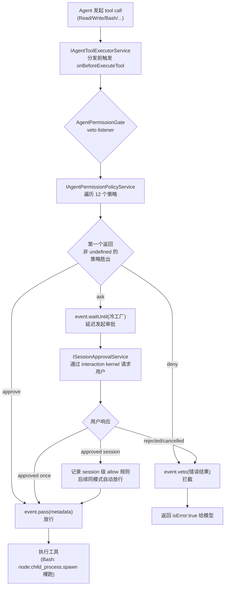

# 第 5 章：安全与权限机制

> 本章导读：kimi-code 的安全模型与多数同类工具不同——它**没有 OS 级沙箱**（无 seatbelt / landlock / sandbox-exec / bubblewrap / 容器），所有副作用操作的安全控制完全发生在**应用层的工具执行拦截**上。读完本章你会理解：一次工具调用经过怎样的策略链裁决、审批往返如何阻塞执行、规则如何用 glob 匹配、工作区信任如何防恶意 checkout，以及"白名单 + 审批"模型相对"沙箱隔离"模型的取舍。建议先读 [第 4 章 Tool 系统](04-tool-system.md) 了解工具执行 harness。

## 5.1 这个机制解决什么问题

一个 Agent 系统会不断产生副作用：写文件、跑 shell 命令、发网络请求。如果没有控制，模型一次"手滑"就可能 `rm -rf` 掉用户目录、把密钥发到外部、或执行刚 clone 下来的恶意仓库里的脚本。kimi-code 要解决的问题是：**在工具真正执行之前，给每一次副作用操作一个可解释的风险裁决，并让用户能在高危操作前介入。**

它的定位很明确：

- 它是一道**应用层闸门**，不是 OS 隔离层。拦截发生在 `node:child_process.spawn` 被调用之前。
- 它**只裁决"能不能做"**，不做"做了之后怎么限制"。一旦裁决放行，命令就以 kimi-code 进程自身的权限裸跑，没有第二层防线。
- 它的默认姿态是**拦截（ask）**，不是放行。除非命中白名单、allow 规则或显式切到 auto/yolo 模式，否则都要问用户。

如果把这个机制抽掉，工具会直接执行——模型说跑什么就跑什么，和直接在终端里 `curl | sh` 没有区别。所以它是 kimi-code 安全性的**唯一承重墙**，理解它的设计边界比理解它的实现更重要（见 5.9）。

## 5.2 全景：一次工具调用的安全路径

整个安全机制挂在工具执行器的一个 veto 事件上。下面是一次工具调用从发起到落地的完整路径：



三个关键事实藏在图里：

1. **拦截点是 `onBeforeExecuteTool`**，一个 veto 风格的事件。监听者可以 `veto(result)`（用给定结果替换执行，`isError:true` 即视为拒绝）、`allow()`（最终放行，结束所有裁决）、`pass(metadata)`（带元数据放行）、或 `waitUntil(factory)`（延迟一个需要外部输入的裁决）。
2. **`ask` 走的是 `waitUntil` 冷工厂**，不是立即发起审批。这个"冷"是刻意设计——只有当没有任何其他监听者直接 veto 或 allow 时，审批往返才真正启动（见 5.4）。
3. **放行之后就是裸 spawn**。`hostProcessService.ts` 里就是 `spawn(command, args, options)`，没有任何沙箱包装。所以"裁决"这一步是真正的安全边界。

## 5.3 三种权限模式：信任梯度

kimi-code 用三个模式表达用户对当前会话的信任程度，模式本身是策略链里的一个节点，而不是开关全局行为的 flag。

| 模式 | 行为 | 典型场景 |
|------|------|----------|
| `manual`（默认） | 基础白名单外的操作都要 ask | 日常开发，谨慎姿态 |
| `auto` | 自动放行，但 deny 规则和 `AskUserQuestion` 的 deny 仍生效 | 信任项目、想少点打扰 |
| `yolo` | 全部放行（bypass），是唯一的逃生通道 | 完全信任的隔离环境 |

模式不是全局短路，而是策略链中的两个节点：`auto-mode-approve` 和 `yolo-mode-approve`。它们在链中的位置很关键——**排在 deny 规则之后**，所以即便切到 auto/yolo，用户显式配置的 deny 规则依然拦得住。默认模式通过配置项 `defaultPermissionMode` 持久化，用 TOML + zod 校验枚举值。

## 5.4 策略链：有序裁决

这是整个安全机制的核心。`AgentPermissionPolicyService` 持有一个**有序的策略数组**，`evaluate` 遍历每个策略，**第一个返回非 `undefined` 结果的策略胜出**，后续策略不再执行：

```ts
async evaluate(context) {
  for (const policy of this.policies) {
    const result = await policy.evaluate(context);
    if (result !== undefined) return { policyName: policy.name, result };
  }
  return undefined;
}
```

12 个策略的固定顺序就是它们的优先级。顺序本身就是设计：

| # | 策略 | 作用 |
|---|------|------|
| 1 | `auto-mode-ask-user-question-deny` | auto 模式下禁止 `AskUserQuestion`（避免自动模式下无限打扰） |
| 2 | `user-configured-deny` | 用户配置的 deny 规则，最高优先级的用户意图 |
| 3 | `auto-mode-approve` | auto 模式放行全部（在 deny 之后，所以 deny 仍生效） |
| 4 | `session-approval-history` | 记住本次会话已批准的操作模式 |
| 5 | `user-configured-ask` | 用户配置的 ask 规则 |
| 6 | `user-configured-allow` | 用户配置的 allow 规则 |
| 7 | `sensitive-file-access-ask` | 命中 `.env` / SSH key / credentials 触发 ask |
| 8 | `git-control-path-access-ask` | 访问 `.git` 控制路径触发 ask |
| 9 | `yolo-mode-approve` | yolo 模式放行全部（排在敏感文件之后） |
| 10 | `default-tool-approve` | 安全工具白名单（Read/Grep/Glob/WebSearch 等）放行 |
| 11 | `git-cwd-write-approve` | git 工作树内的 Write/Edit 放行 |
| 12 | `fallback-ask` | 兜底 ask |

读这个顺序能读出几个设计意图：

- **deny 永远最先**（#2），所以用户显式拒绝的操作无论什么模式都拦得住。
- **敏感文件检测（#7）排在 yolo 放行（#9）之前**——这意味着即便在 yolo 模式下，访问 `.env` 仍会 ask。这是有意保留的最后一道用户提醒。
- **白名单放行（#10）在敏感文件之后**，所以白名单工具碰到敏感路径仍会被 #7 拦下。
- **兜底是 ask（#12），不是 allow**。这是默认拦截姿态的来源。

### `waitUntil` 冷工厂：避免无谓审批

`ask` 决策不直接发起审批，而是调用 `event.waitUntil(() => this.toolApproval.requestToolApproval(...))`。`waitUntil` 接收的是一个**工厂函数**，不是 Promise。工具执行器只在"没有其他监听者直接 veto 或 allow"时才调用这个工厂。

这解决了一个微妙的竞态：假设同时挂了另一个监听者（比如 Plan Mode 守卫）会直接 veto 某些调用。如果 `ask` 立即发起审批，用户可能已经看到审批弹窗了，结果却被另一个监听者 veto 掉——弹窗成了无意义的打扰。冷工厂保证审批往返**只在确实需要用户介入时**才启动。

## 5.5 规则系统：picomatch glob

策略链里的 #2/#5/#6（用户配置的 deny/ask/allow）和 #4（会话记忆）都依赖一套统一的规则匹配。规则是一个四元组：

```ts
interface PermissionRule {
  readonly decision: 'allow' | 'deny' | 'ask';
  readonly scope: 'turn-override' | 'session-runtime' | 'project' | 'user';
  readonly pattern: string;
  readonly reason?: string;
}
```

### 模式语法：`toolName(argPattern)`

`pattern` 用 picomatch glob，不是正则。两种形式：

- `Bash`：只匹配工具名，匹配该工具的所有调用。
- `Bash(rm:*)`：工具名 + 括号里的参数模式。工具名部分可用 `*` 通配（`*(rm:*)` 匹配所有工具的 rm 命令）。

工具名匹配用 `picomatch.isMatch(toolName, parsed.toolName)`；参数匹配则委托给**工具自己提供的 `matchesRule` 闭包**。这是关键设计——不同工具的"参数"语义不同，所以匹配逻辑由工具自治：

- 对 Bash，参数模式匹配的是**命令字符串**。Bash 工具在 `resolveExecution` 里声明 `matchesRule: (ruleArgs) => matchesGlobRuleSubject(ruleArgs, args.command)`，所以 `Bash(rm:*)` 能匹配 `rm -rf /tmp/x`。
- 用户点"approve for session"时，Bash 会把 `literalRulePattern(Bash, command)` 存为会话级 allow 规则——精确到这一条命令字面量，不是通配，避免误放行相似但不同的命令。

### 四种 scope

| scope | 含义 | 存储位置 |
|-------|------|----------|
| `turn-override` | 单轮覆盖，最高优先 | 内存 |
| `session-runtime` | 会话级（"approve for session" 产生） | 内存，会话结束失效 |
| `project` | 项目级 | 项目配置 |
| `user` | 用户级（默认） | 用户配置 |

### 配置：TOML `[permission]` 段

规则持久化在 TOML 的 `[permission]` 配置段，自注册到 config 系统。支持两种写法——简写列表和显式 rules 数组，schema 用 zod 校验：

```toml
# 简写
[permission]
deny = ["Bash(rm -rf:*)"]
allow = ["Read", "Grep"]

# 显式
[[permission.rules]]
decision = "ask"
pattern = "Write(.env*)"
scope = "user"
```

配置层做了 snake_case ↔ camelCase 的 TOML 转换，把简写 `deny/allow/ask` 列表和 `tool`+`match` 简写都归一化成内存里的 `rules` 数组。

## 5.6 审批往返：异步阻塞 broker

当策略链给出 `ask`，工具执行被**异步阻塞**，直到用户响应。这条往返由 `AgentToolApprovalService` 编排：

1. **发布事件**：`eventBus.publish({ type: 'permission.approval.requested', ... })`，UI 层（TUI 的 approval-panel / VSCode 的 approval store）订阅它来渲染弹窗。
2. **请求 broker**：`await abortable(approvalService.request(approvalRequest), context.signal)`。`SessionApprovalService` 是 `ISessionInteractionService`（交互内核）的 facade，内核持有 pending 状态，`decide(id, response)` 解锁对应的 promise。整个等待挂在 `AbortSignal` 上，取消信号会传播。
3. **记录结果**：用户选"approve for session"时，把 `context.execution.approvalRule`（工具声明的会话级规则模式）写入 `rulesService`，后续同模式调用被策略 #4 自动放行。同时发 `permission.approval.resolved` 事件 + telemetry。
4. **唤醒执行**：approved 则放行执行；rejected/cancelled 则 `event.veto(denyToolExecution(...))`，返回 `isError:true` 给模型。

### 无 broker 自动放行

一个重要的边界行为：`tryApprovalService()` 取不到 broker 时（headless、非交互场景），直接 `response = { decision: 'approved' }`。也就是说**非交互环境下 ask 退化为自动放行**。这是为了让 Agent 能在 CI/无 TTY 场景跑起来，但也是一个需要警惕的退化——headless 模式下策略链的 ask 实际不拦。

### 子代理的拒绝引导

当被拒的工具调用来自非 main agent（子代理/worker），拒绝消息会追加一句指令：

> Try a different approach - don't retry the same call, don't attempt to bypass the restriction.

这是给模型的提示工程，让 worker 被拒后换思路而不是死磕或尝试绕过。

## 5.7 工作区信任：防恶意 checkout

这是 kimi-code 一个独立于策略链的机制，解决一个特定威胁：**刚 clone 下来的恶意仓库**。

恶意仓库可以在项目里放 `.mcp.json`、`AGENTS.md`、hooks 配置等，让 Agent 一打开就自动加载恶意 MCP server 或执行恶意指令。`WorkspaceTrustService` 给每个 workspace 一个 yes/no 信任标志，**控制项目级配置是否被加载**。未信任时，项目级 MCP 配置被跳过。

关键设计是**信任标记存放在 workspace 之外**（kimi home 下，按 `encodeWorkDirKey(cwd)` 作 key），所以一个 checked-out 的树**无法预先标记自己为信任**——恶意仓库没法在自身里放一个文件就让自己变信任。读取失败时解析为未信任（fail-safe），且只能通过显式 `trust()`/`untrust()` 翻转，引擎不会主动弹窗问。

## 5.8 路径保护：词法围栏

文件工具（Read/Write/Edit/Grep/Glob）有一套独立的路径策略，在工具内部执行，不走策略链：

- **敏感文件检测** `isSensitiveFile()`：识别 `.env` / `.env.*`（除 `.env.example`/`.env.sample`/`.env.template`）、SSH 私钥（`id_rsa`/`id_ed25519`/`id_ecdsa` 及其 `.pem`/`.bak`/`.old` 变体）、`credentials`、`.aws/credentials`、`.gcp/credentials`。公钥（`.pub`）显式豁免。命中敏感文件会触发策略 #7 的 ask。
- **工作区围栏** `isWithinWorkspace()`：工作区外路径要求绝对路径，否则抛 `PathSecurityError`。
- **共享前缀逃逸防护**：`isWithinDirectory` 要求前缀后是路径分隔符（或精确相等），阻止 `/workspace-evil` 伪装成 `/workspace` 通过 `startswith` 检查。
- **跨平台**：用 `pathe` 库 + pathClass（posix/win32），处理 cygdrive、盘符相对路径。SSH 路径强制 POSIX，即使宿主 Node 跑在 Windows 上。

### 已知限制：不跟随 symlink

文档和注释里明确说明：路径规范化是**纯词法**的，不调 `realpath`、不跟随符号链接。这意味着一个指向工作区外的 symlink 可能绕过围栏。这是 kimi-code 的已知边界，不是 bug——它换来了无 IO 的快速检查和跨 host 一致性（远程 SSH host 上 realpath 语义可能不同）。代价是：对符号链接攻击不设防，需要配合工作区信任来降低风险。

## 5.9 设计取舍：白名单模型 vs 沙箱模型

理解 kimi-code 安全机制的关键，是理解它**刻意没有**做什么。

它没有 OS 级沙箱。确定性搜索 `seatbelt|landlock|sandbox-exec|chroot|seccomp|bubblewrap|firejail|AppContainer|JobObject` 在整个仓库的结果为 0。命令执行就是 `node:child_process.spawn` 裸跑，跨平台处理仅限于 `detached`（非 Windows 默认 true）、`windowsHide`、以及进程树终止（Windows 用 `taskkill /T /F`，Unix 用进程组 kill）。

这是一个明确的设计选择，对比"沙箱隔离"模型：

| 维度 | kimi-code（白名单 + 审批） | 沙箱隔离模型 |
|------|--------------------------|--------------|
| 防线层数 | 1 层（应用层策略链） | 2 层（策略层 + OS 沙箱） |
| 放行后约束 | 无，宿主全权限裸跑 | 仍受沙箱文件/网络/进程限制 |
| 绕过后果 | 命令以宿主权限直接执行 | 仍困在沙箱内 |
| 实现复杂度 | 纯 TS，跨平台一致 | 需要每平台一套 OS 原语 |
| 部署依赖 | 零二进制依赖 | 需要随包预编译沙箱二进制 |

kimi-code 选前者，换来的是：**轻量、跨平台行为完全一致、零原生依赖、易移植**。代价是：一旦策略逻辑被绕过（通过未被策略覆盖的工具、symlink 逃逸词法检查、或未来新增工具忘了接策略链），命令将以宿主进程全权限执行，没有兜底。

它用几个补偿手段缩小攻击面：

- **`waitUntil` 冷工厂**避免审批逻辑被旁路。
- **敏感文件词法检测** + **工作区围栏**拦截常见误操作。
- **workspace trust** 阻断恶意 checkout 的配置注入。
- **worker 拒绝引导**降低子代理绕过意图。
- **deny 规则最高优先**保证用户硬性意图不被模式覆盖。

但这些补偿都是**应用层**的，本质仍是"放行前审批"，不是"放行后隔离"。这是 kimi-code 安全模型的根本边界，使用时需明确：它防的是"模型手滑"和"常见误操作"，不防"有针对性的沙箱逃逸"。

## 5.10 关键实现入口

| 职责 | 文件 |
|------|------|
| 策略链引擎（12 策略有序遍历） | `packages/agent-core-v2/src/agent/permissionPolicy/permissionPolicyService.ts` |
| 12 个策略实现 | `packages/agent-core-v2/src/agent/permissionPolicy/policies/*.ts` |
| 工具执行 veto 事件 + `waitUntil` 冷工厂契约 | `packages/agent-core-v2/src/agent/toolExecutor/toolHooks.ts` |
| 权限 gate（挂 `onBeforeExecuteTool`，分发 approve/deny/ask） | `packages/agent-core-v2/src/agent/permissionGate/permissionGateService.ts` |
| 审批往返（事件发布、broker 等待、会话规则记录、worker 拒绝引导） | `packages/agent-core-v2/src/agent/toolApproval/toolApprovalService.ts` |
| 会话级审批 broker（interaction kernel facade） | `packages/agent-core-v2/src/session/approval/approvalService.ts` |
| 权限模式契约 | `packages/agent-core-v2/src/agent/permissionMode/permissionMode.ts` |
| 模式默认值配置段 | `packages/agent-core-v2/src/agent/permissionMode/configSection.ts` |
| 规则契约 + scope/decision 类型 | `packages/agent-core-v2/src/agent/permissionRules/permissionRules.ts` |
| picomatch 规则匹配 + `toolName(argPattern)` 解析 | `packages/agent-core-v2/src/agent/permissionRules/matchesRule.ts` |
| `[permission]` TOML 配置 schema + 转换 | `packages/agent-core-v2/src/agent/permissionRules/configSection.ts` |
| Bash 工具命令级匹配（`matchesRule` 闭包 + `approvalRule`） | `packages/agent-core-v2/src/agent/tools/os/bash/bashTool.ts` |
| 工作区信任（标记存 workspace 之外） | `packages/agent-core-v2/src/workspace/workspaceTrust/workspaceTrustService.ts` |
| 路径保护（敏感文件检测 + 工作区围栏，词法） | `packages/agent-core-v2/src/tool/path-access.ts` |
| 进程 spawn（裸跑，无沙箱） | `packages/agent-core-v2/src/os/backends/node-local/hostProcessService.ts` |
| 安全工具白名单 | `packages/agent-core-v2/src/agent/permissionPolicy/policies/default-tool-approve.ts` |
| ACP 协议层审批映射 | `packages/acp-adapter/src/approval.ts` |
| UI 审批组件 | `apps/kimi-code/src/tui/components/dialogs/`、`apps/vscode/webview-ui/src/stores/approval.store.ts` |

## 5.11 小结

kimi-code 的安全机制是一个**单层、应用层、工具执行拦截**的模型。它的承重结构是四件事：

1. **有序策略链**——12 个策略按固定优先级裁决，第一个非 undefined 结果胜出，deny 永远最先，兜底是 ask。
2. **异步阻塞审批**——`ask` 通过 `waitUntil` 冷工厂延迟发起 broker 往返，避免无谓打扰；会话级记忆让相同操作只问一次。
3. **picomatch glob 规则**——`toolName(argPattern)` 格式，参数匹配委托给工具自治的 `matchesRule` 闭包，TOML 持久化。
4. **工作区信任**——标记存 workspace 之外，防恶意 checkout 自标记，控制项目级配置加载。

它的根本边界是**没有 OS 沙箱**：放行即裸跑，没有第二层防线。这换来轻量和跨平台一致，代价是绕过即失守。理解这一点，才能正确评估它在不同威胁模型下的适用性——它适合"防模型手滑"的日常开发场景，不适合作为对抗性隔离边界。
