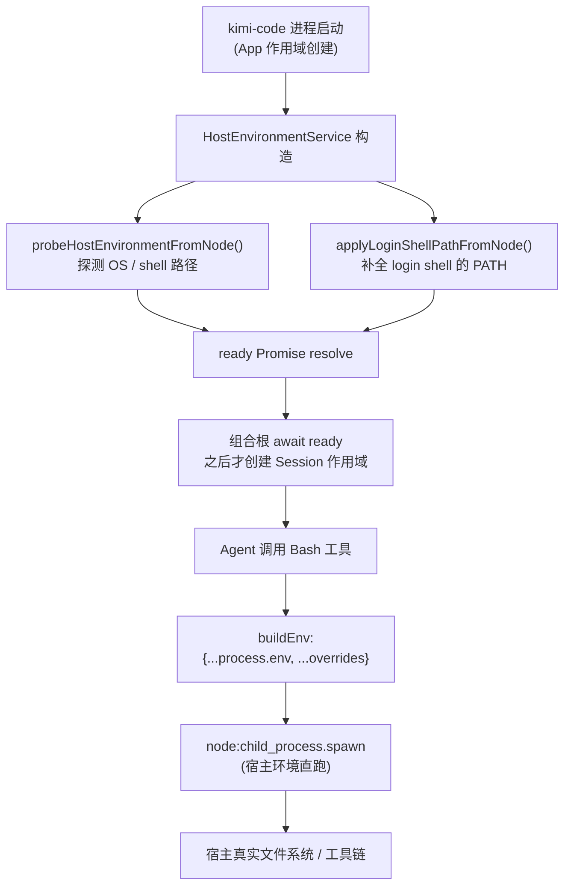

# 第 6 章：执行环境与宿主探测


> **文档同步跟踪**
> - 最后同步代码：`kimi-code` commit `c3a2ef0ce`（2026-08-27）
> - 同步方式：基于该文档撰写时的源码路径与提交记录梳理

> 本章导读：kimi-code 跑命令时用的是**宿主的真实环境**，它不预制任何运行环境（不建 venv、不装 Python、不动 conda），只做"探测 + 补全"宿主已有的环境。读完本章你会理解：命令到底在什么环境里执行、PATH 怎么补全的、Windows 上怎么找 bash、以及"借宿主"而非"造环境"这个设计选择的代价。建议先读 [第 4 章 Tool 系统](04-tool-system.md) 和 [第 5 章 安全与权限](05-security-and-permissions.md)，了解工具执行 harness 和安全闸门。

## 6.1 这个机制解决什么问题

一个 Agent 系统要跑 shell 命令、读写文件，就绕不开一个问题：**这些操作在什么环境里执行？** 有两条路：

1. **造环境**：自己带一套运行时（解释器、依赖、PATH），在隔离的容器/沙箱/虚拟环境里跑。
2. **借宿主**：直接用用户机器上已有的环境，自己只负责"找到它"和"正确地调用它"。

kimi-code 明确选了第二条。它不预制任何运行环境：

- 不建 Python venv、不装 Python、不管 conda/pyenv/poetry。
- 不带容器、不带沙箱根文件系统。
- 不替用户管理依赖、不隔离项目间的依赖版本。

它的职责只到"**探测宿主的事实 + 补全 PATH + 把命令交给正确的 shell 跑**"为止。把这条机制抽掉，Bash 工具就不知道用哪个 shell、找不到用户装的工具，但 kimi-code 本身不会因此"造"一个环境出来--它会直接报错让你自己装。

## 6.2 全景：从启动到命令落地的环境路径



两个关键事实：

1. **探测发生在 App 启动时，一次性完成**。`HostEnvironmentService` 是 App 作用域单例，构造时并行跑探测和 PATH 补全，结果 memoize，进程生命周期内不变。组合根 `await ready` 之后才创建 Session，保证下游同步读字段不会拿到空值。
2. **spawn 时是宿主环境的直传**。`buildEnv` 就是 `{ ...process.env, ...overrides }`，原样继承 kimi-code 进程自己的环境。

## 6.3 核心抽象：HostEnvironmentInfo

`IHostEnvironment` 是一个**不可变的宿主快照**，App 作用域单例：

| 字段 | 含义 | 来源 |
|------|------|------|
| `osKind` | macOS / Linux / Windows | `process.platform` 映射 |
| `osArch` | CPU 架构 | `process.arch` |
| `osVersion` | 内核版本 | `os.release()` |
| `homeDir` | 用户家目录 | `os.homedir()` |
| `pathClass` | `posix` / `win32` | 平台决定路径风格 |
| `shellName` | `bash` / `sh` | 探测结果 |
| `shellPath` | shell 可执行文件绝对路径 | 探测结果 |
| `ready` | 探测完成 Promise | 组合根 await |

注释里明确说这是个"pure function of the host"，进程生命周期内不变。`ready` 之前读字段会抛 `BugIndicatingError`--刻意 fail loud，不返回陈旧默认值。

## 6.4 探测：找对 shell 是关键

Bash 工具的语法是 POSIX 的（`shell -c 'cd <cwd> && <command>'`），所以**必须有一个可用的 POSIX shell**。探测逻辑分平台：

### macOS / Linux：按序找 bash

按 `/bin/bash` -> `/usr/bin/bash` -> `/usr/local/bin/bash` 顺序找，命中用 bash；全 miss 则 fallback 到 `/bin/sh`。不会失败，因为 `/bin/sh` 一定存在。

### Windows：强制找 Git for Windows / MSYS2 的 bash

Windows 没有自带 POSIX shell，所以 kimi-code 要求装 Git for Windows 或 MSYS2。探测顺序：

1. **环境变量覆盖**：`KIMI_SHELL_PATH` 指向的 `bash.exe`（用户显式指定）
2. **从 PATH 上的 `git.exe` 反推**：找到 `git.exe` 后，调用 `git --exec-path` 拿到 Git 安装根，再根据 mingw 前缀（`mingw32`/`mingw64`/`ucrt64`/`clang64`/`clangarm64`）推断 bash 路径
3. **常见安装路径**：`C:\Program Files\Git\bin\bash.exe` 等，外加 `%LOCALAPPDATA%\Programs\Git\...`
4. **全找不到 -> 抛错**：要求装 Git for Windows 或设 `KIMI_SHELL_PATH`

这个硬约束是 kimi-code 在 Windows 上的唯一"环境要求"--它不装 bash，但要求宿主有 bash。

## 6.5 补全 PATH：唯一"改"环境的动作

这是 kimi-code 对宿主环境**唯一的写操作**，解决一个具体痛点：

> 从 GUI 启动器、launchd、非 login shell 拉起的进程，`process.env.PATH` 缺了用户交互 shell 里的路径（典型如 `/opt/homebrew/bin`），导致 Bash 工具找不到 `gh` 这类用户装的工具。

做法：跑一次用户的 login shell，抓它的 PATH，补到当前 PATH 末尾。

```
$SHELL -l -c /usr/bin/env    # 5s 超时
→ 解析输出里的 PATH= 行
→ mergeLoginShellPath: 已有条目保持原序和优先级，只追加缺失的、以 / 开头的条目
→ 写回 process.env.PATH
```

几个设计细节：

- **只补不替**：已有条目顺序和优先级不变，新条目追加到末尾。
- **fail-safe**：没有可解析的 shell、profile 卡住、超时--静默不动 PATH，不报错。
- **`$SHELL` 没设时**从用户数据库 (`os.userInfo().shell`) 取账号 login shell 兜底（launchd 启动常丢 `$SHELL`）。
- **Windows 跳过**：这是 POSIX login shell profile 的特有问题。

## 6.6 spawn 时的环境构建

到 Bash 工具真正 spawn 时，环境是这样拼的：

```ts
// bashTool.ts: spawn()
const noninteractiveEnv = {
  NO_COLOR: '1',
  TERM: 'dumb',
  GIT_TERMINAL_PROMPT: process.env['GIT_TERMINAL_PROMPT'] ?? '0',
  SHELL: this.env.shellPath,
};
return this.runner.exec(shellArgs, { env: noninteractiveEnv });

// hostProcessService.ts: buildEnv()
function buildEnv(overrides) {
  if (overrides === undefined) return undefined;
  return { ...process.env, ...overrides };
}
```

最终 spawn 的 env = `process.env`（含已补全的 PATH）+ 4 个非交互终端变量。这 4 个变量的目的：

- `NO_COLOR=1` / `TERM=dumb`：禁用颜色和终端特性，让输出是纯文本，好解析。
- `GIT_TERMINAL_PROMPT=0`：Git 不弹交互式凭证提示，避免卡死。
- `SHELL=<shellPath>`：让子进程知道自己在哪个 shell 下。

这就是全部。没有 `installPrefix`、`containerEnv`、`isolatedEnv`、`workspaceEnv`--全仓库搜不到任何环境隔离/前缀机制。

## 6.7 实际影响：装依赖直接进宿主

因为命令在宿主环境裸跑，所以模型装依赖时：

| 模型跑的命令 | 实际落点 |
|-------------|---------|
| `pip install requests` | 宿主当前 Python 的 site-packages（系统 Python 或当前激活的 venv，取决于用户宿主状态） |
| `npm install -g xxx` | 宿主全局 node_modules |
| `brew install xxx` | 宿主 Homebrew |
| `rm xxx` | 宿主真实文件系统（[第 5 章](05-security-and-permissions.md) 的安全闸门是唯一拦截） |

kimi-code 不管这些，它只是传声筒：模型说跑啥，就在宿主 shell 里跑啥，装到哪由用户宿主环境决定。不同项目要不同依赖版本？kimi-code 不帮忙，用户得自己用 venv/conda/pyenv 在项目里隔离好，并保证激活后 PATH 能让 kimi-code 找到。

## 6.8 设计取舍：借宿主 vs 造环境

理解 kimi-code 环境机制的关键，是理解它**刻意不做什么**。

它不预制运行时、不带解释器、不建虚拟环境、不隔离依赖。这是一个明确的设计选择，对比"造环境"模型：

| 维度 | kimi-code（借宿主） | 造环境模型 |
|------|---------------------|-----------|
| 环境来源 | 宿主已有 | 自带/自建 |
| 依赖落点 | 宿主真实环境 | 隔离层内 |
| 项目间隔离 | 不管，用户自理 | 通常按项目隔离 |
| 部署体积 | 零运行时依赖 | 需随包带解释器/容器 |
| 跨平台一致性 | 依赖宿主装了什么 | 自带一致环境 |
| 启动开销 | 几乎为零 | 容器/venv 创建开销 |

kimi-code 选前者，换来的是**轻量、零原生依赖、易移植**--这和它整体定位（见 [第 5 章 5.9](05-security-and-permissions.md)）一致。代价是：

- **环境干净与否是用户的责任**。依赖装哪、版本冲突、全局污染，kimi-code 不参与。
- **跨机器一致性靠用户保证**。换个机器没装 Python，kimi-code 不会帮你装，只会报错。
- **项目隔离靠用户自己**。要用 venv/conda，用户自己在项目里建好、激活好。

它唯一的"干预"是 Windows 上强制要求 bash--因为它的 Bash 工具语法是 POSIX 的，这是个硬约束，不是环境预制。其余情况下，它的姿态是：**你宿主有什么，我就用什么；找不到，我报错，但绝不替你造。**

## 6.9 关键实现入口

| 职责 | 文件 |
|------|------|
| 宿主环境契约（不可变快照） | `packages/agent-core-v2/src/os/interface/hostEnvironment.ts` |
| App 作用域实现（启动时探测 + 补 PATH） | `packages/agent-core-v2/src/os/backends/node-local/hostEnvironmentService.ts` |
| OS/shell 探测（纯函数，跨平台） | `packages/agent-core-v2/src/_base/execEnv/environmentProbe.ts` |
| login shell PATH 补全 | `packages/agent-core-v2/src/_base/execEnv/loginShellPath.ts` |
| spawn + buildEnv（宿主环境直传） | `packages/agent-core-v2/src/os/backends/node-local/hostProcessService.ts` |
| Bash 工具 spawn（非交互终端 env） | `packages/agent-core-v2/src/agent/tools/os/bash/bashTool.ts` |

## 6.10 小结

kimi-code 是个**透明的宿主执行器**。它不造环境、不隔离、不管理依赖，只做三件事：

1. **探测宿主事实**--OS、架构、shell 路径，进程启动时一次性完成，结果不变。
2. **补全 PATH**--跑一次 login shell 抓 PATH，追加缺失条目，让 GUI/launchd 启动也能找到用户装的工具。
3. **正确地调用 shell**--用探测到的 bash/sh，加几个非交互终端变量，在宿主环境直跑命令。

命令落在宿主真实文件系统，依赖装进宿主真实环境，项目隔离是用户的事。这是"借宿主"路线的必然代价，也是 kimi-code 轻量定位的必然选择--要环境隔离和一致性，就得带运行时/容器，那就不是 kimi-code 了。