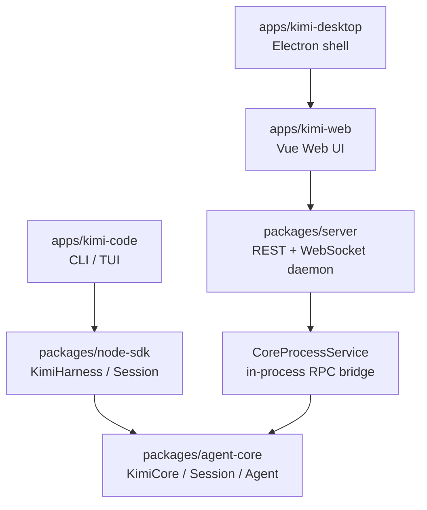
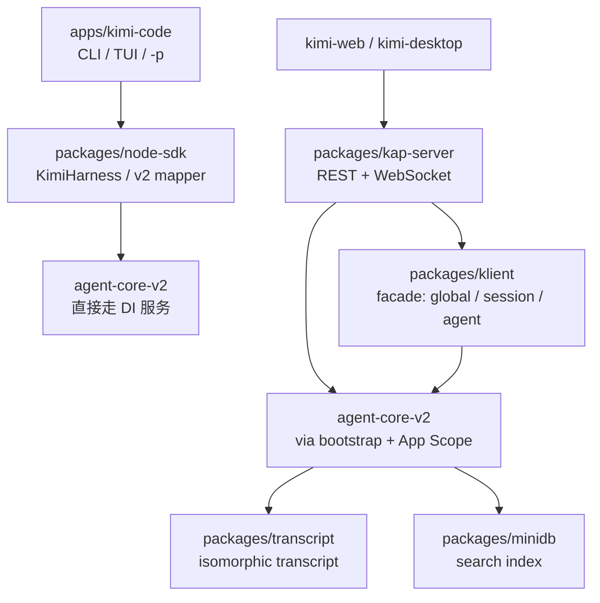
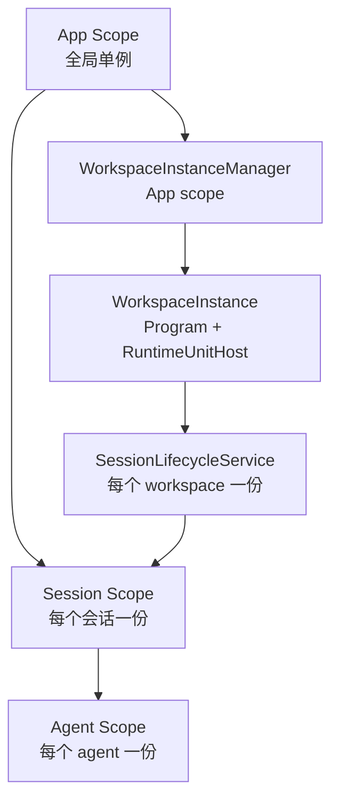
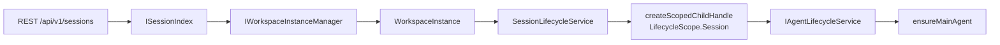

# 07. agent-core-v2 与 kap-server 新架构

> **文档同步跟踪**
> - 最后同步代码：`kimi-code` commit `c3a2ef0ce`（2026-08-27）
> - 同步方式：基于 git log、包结构、AGENTS.md、源码路径与关键入口梳理
> - 说明：v2 仍在快速迭代，Workspace 层的实现细节可能继续演化；本文以当前代码为准

## 1. 这篇文档解决什么问题

到 2025 年 8 月为止，Kimi Code 的核心引擎是 `packages/agent-core`（后称 **v1**）。v1 用一个比较传统的面向对象模型组织：`KimiCore` 创建 `Session`，`Session` 创建 `Agent`，`Agent` 内部有 loop、plan、subagent、tools 等模块。已有的六篇拆解笔记（`01`–`06`）都是围绕这套 v1 架构写的。

从 2026 年 7 月开始，仓库里出现了一套并行的 `packages/agent-core-v2`（后称 **v2**），以及基于 v2 的 `packages/kap-server`。v2 不是 v1 的小重构，而是把整个 Agent 引擎重新建构成 **DI × Scope** 架构：

- 所有能力被拆成生命期明确的 **Service**；
- 生命周期按 **App → Workspace → Session → Agent** 四层嵌套；
- 依赖注入容器负责创建、缓存、级联销毁；
- 能力通过 **Feature** 缝（seam）注册，可装配、可回退；
- 传输、协议、转录、搜索被拆成独立包（`transcript`、`protocol`、`klient`、`minidb`）。

这篇文档给出 v2 的心智模型和关键代码路径，帮你在读源码时判断：什么时候可以回到 v1 文档，什么时候必须进 v2 代码。

## 2. v2 不是“另一个 agent-core”

先看两张运行图的差异。

### 2.1 v1 的运行图



v1 的 Web / Desktop 要先把请求发到 `packages/server`，`server` 再通过 `CoreProcessService` 调用 `agent-core`。CLI / TUI 则通过 `node-sdk` 直接调用 `agent-core`。

### 2.2 v2 的运行图



v2 的关键变化：

- CLI / TUI 默认也走 v2，不再直接绑定 v1；
- `kimi web` 永远启动 `kap-server`，`kap-server` 是唯一的服务器风味；
- `packages/server`（v1 的 daemon）仍然存在，但只服务于旧入口；
- 新客户端统一用 `packages/klient` 的 facade；
- 转录层被抽出为 `packages/transcript`，浏览器和服务器共享同一套数据结构；
- 全局搜索用 `packages/minidb` 做持久化索引。

### 2.3 v1 / v2 切换门

`apps/kimi-code/src/cli/experimental-v2.ts` 里明确了切换门：

- `KIMI_CODE_LEGACY_FLAG=1`：CLI / TUI 走 v1；
- 否则默认走 v2；
- `kimi web` 永远走 v2，不看这个开关；
- `KIMI_CODE_EXPERIMENTAL_FLAG` 只是控制实验功能，不负责选引擎。

源码入口：

- `apps/kimi-code/src/cli/run-shell.ts` — TUI 入口，默认 v2；
- `apps/kimi-code/src/cli/run-prompt.ts` — `kimi -p` 入口，默认 v2；
- `apps/kimi-code/src/cli/sub/web/run.ts` — `kimi web` 入口，直接启动 `kap-server`。

## 3. 包结构总览

v2 出现后，仓库里新增 / 强化了这些包：

| 包 | 职责 | 与 v1 的关系 |
|---|---|---|
| `packages/agent-core-v2` | 新 Agent 引擎 | 与 `packages/agent-core` 并行，默认逐步替代 |
| `packages/kap-server` | REST + WebSocket 服务器 | 替代 `packages/server` 作为 Web / Desktop 后端 |
| `packages/klient` | 客户端 SDK facade | 新统一客户端，覆盖 memory / ipc / REST 三种传输 |
| `packages/transcript` | 转录数据层 | 从引擎里拆出，浏览器和服务器共享 |
| `packages/minidb` | 嵌入式 JSON 文档存储 | 支撑 kap-server 的跨会话搜索索引 |
| `packages/protocol` | 共享协议类型 | 已从 v1 的 `agent-core` 拆出 |

入口索引：

- `packages/agent-core-v2/src/index.ts` —— v2 引擎导出；
- `packages/kap-server/src/start.ts` —— 服务器启动；
- `packages/kap-server/src/routes/registerApiV1Routes.ts` / `registerApiV2Routes.ts` —— 路由注册；
- `packages/klient/src/core/klient.ts` —— klient facade；
- `packages/transcript/src/contract/` —— 转录协议类型。

## 4. DI × Scope：v2 的核心心智模型

v2 最大的设计变化是把“对象怎么创建、活多久、怎么销毁”从业务代码里抽出来，交给 DI 容器。理解这一点，后面所有代码路径都会变得清晰。

### 4.1 四层生命期

v2 把状态按生命期分成四层：

| 层 | 身份（key） | 典型状态 | 销毁时机 |
|---|---|---|---|
| **App** | 无，全局唯一 | 日志、遥测、配置、会话索引、全局搜索 | 进程退出 |
| **Workspace** | `workspaceId` | 工作区目录、工作区级 skill / MCP / agent profile、信任状态 | 进程退出（handler 不会被主动关闭） |
| **Session** | `sessionId` | 会话上下文、history、转录、待办 | 会话关闭 / 归档 |
| **Agent** | `agentId` | 当前 agent 的 loop 状态、tool 执行、goal / plan / tower | agent 销毁 |

> 注意：`packages/agent-core-v2/src/app/scopes.ts` 里的 `LifecycleScope` 枚举目前只声明了 `App`、`Session`、`Agent` 三个值，拓扑也是 `[App, Session, Agent]`。Workspace 层在代码里以 **WorkspaceInstance**（Program + RuntimeUnitHost）的形式实现，而不是一个独立的 DI scope kind。后续如果拓扑扩展，只需改这里和少数注册点。

父子关系：



### 4.2 Service / Fiber / Collection

v2 的 DI 内核在 `packages/agent-core-v2/src/_base/di/`。几个核心抽象：

- **Service**（`src/_base/di/service.ts`）：业务单元的基类。构造阶段只能用 `provide` / `on` / `effect` 声明贡献和副作用；构造完成后才能通过 `get` / `ref` 读取依赖。**不要直接用 `new` 创建带依赖的 Service。**
- **Fiber**（`src/_base/di/fiber.ts`）：一个可生命周期化的单元句柄，状态机是 `Pending → Activating → Active → Unloading → Failed`。`provide` 返回 `FiberHandle`。
- **Collection**（`src/_base/di/collection.ts`）：贡献点。一个域通过 `collection<T>(name)` 声明贡献槽，其他域用 `this.provide(token, value)` 往里加记录，再通过 `CollectionView` 读取合并后的视图。provider 死亡会自动撤回记录。
- **ScopeUnits**（`src/_base/di/scopeUnits.ts`）：当创建某层 scope 时，自动实例化该层注册的所有 recipe。Feature 的 `contributeService(scope, ...)` 就是通过 ScopeUnits 实现的。
- **CascadeEngine**（`src/_base/di/cascadeEngine.ts`）：级联引擎，负责 provide / unprovide / update 的事务、依赖图、反向拓扑销毁、等待区重试。

### 4.3 四个主要贡献缝

v2 的能力装配靠四个 collection：

1. **ConfigSectionContribution** → `ConfigRegistry`：配置段；
2. **AgentToolContribution** → `AgentToolActivationService`：agent 工具；
3. **AgentProfileContribution** → `IAgentProfileRegistry`：agent profile；
4. **EventStateContribution** / replayable state → `IEventDispatcher`：事件与状态；
5. **CommandContribution** → `IAgentCommandService`：可运行的 engine-side 命令；
6. **FeatureServiceContribution** + **ScopeUnits(scope)** → 按 scope 自动实例化 Service。

所有缝都走同一条 `provide` 路径，因此 Feature 的装配、静态注册、seed 覆盖可以共存。

### 4.4 Feature：内建能力的装配单元

`packages/agent-core-v2/src/features/feature.ts` 定义了 `Feature` 基类。一个 Feature 是一个自包含的能力单元（如 `plan`、`goal`、`swarm`、`tower`、`skill`、`externalHooks`）。

Feature 在构造函数里声明贡献：

- `contributeAgentService(id, ServiceCtor)` —— 在每个 Agent scope 里实例化一个 Service；
- `contributeTool(id, ToolCtor, options)` —— 注册一个 Agent 工具（按 name 过滤后构造）；
- `contributeProfiles(profiles)` —— 注册 agent profile；
- `contributeConfig(domain, schema)` —— 注册配置段；
- `contributeCommand({ name, run })` —— 注册 engine-side 命令；
- `onDispose(fn)` —— Feature 被撤回时清理。

Feature 通过 `registerFeature(FeatureClass)` 在模块顶层自注册；`src/index.ts` 精确导入这些叶子模块；App scope 创建时由 `IFeatureAssemblyService` 统一装配。撤回一个 Feature 会自动级联撤回它在各层 scope 里贡献的 Service 和工具（连坐）。

当前内建 Feature 都在 `packages/agent-core-v2/src/features/` 下。

## 5. 启动流程：从进程到 App Scope

### 5.1 `kimi web` 启动 `kap-server`

`apps/kimi-code/src/cli/sub/web/run.ts` 组装服务器参数，调用 `packages/kap-server/src/start.ts` 里的 `startServer`。

`startServer` 的关键动作：

1. 解析 `homeDir`、`port`、`host`；
2. 创建 `InstanceRegistry`（保证多实例不冲突）；
3. 调用 `bootstrap(...)` 创建 App Scope；
4. 从 App Scope 取出 `ISessionIndex`、`IWorkspaceInstanceManager` 等；
5. 注册 Fastify 中间件：CORS、auth、request-id、security headers；
6. 注册 REST 路由（`/api/v1/*`、`/api/v2/*`）和 WebSocket（`/api/v1/ws`）；
7. 启动监听。

源码入口：

- `packages/kap-server/src/start.ts`
- `packages/kap-server/src/routes/registerApiV1Routes.ts`
- `packages/kap-server/src/routes/registerApiV2Routes.ts`
- `packages/kap-server/src/transport/ws/v1/registerWsV1.ts`

### 5.2 `bootstrap` 创建 App Scope

`packages/agent-core-v2/src/app/bootstrap/bootstrapService.ts` 里的 `bootstrap` 函数：

1. 创建 App Scope（`Scope.createApp`）；
2. 注入进程级 seed（`IBootstrapOptions`、`IHostEnvironment` 等）；
3. 触发 cascade，把所有静态注册和 Feature 的 App-scope 单元实例化；
4. 返回 App Scope 句柄。

App Scope 里的关键全局服务：

- `ISessionIndex` —— 会话索引；
- `IWorkspaceInstanceManager` —— 工作区实例管理；
- `IGlobalSearchService` —— 全局搜索（含 worker thread）；
- `IConfigService` / `IConfigRegistry` —— 配置；
- `ITelemetryService` —— 遥测；
- `IFlagService` / `IFlagRegistryService` —— 实验开关；
- `IPluginService` —— 插件；
- `IMcpRegistryService` / `IMcpManagementService` / `IMcpOAuthService` —— MCP。

### 5.3 CLI / TUI 直接启动 v2

CLI / TUI 不经过 `kap-server`，而是直接 import `@moonshot-ai/agent-core-v2`，用 `bootstrap` 创建 App Scope，然后通过 SDK 的 v2 mapper 调用引擎服务。

关键文件：

- `apps/kimi-code/src/cli/run-shell.ts`
- `apps/kimi-code/src/cli/run-prompt.ts`
- `apps/kimi-code/src/cli/v2/run-v2-print.ts` —— `kimi -p` 的 v2 渲染循环，直接消费 DI 服务的事件。

## 6. Workspace：不是 DI Scope，而是 Runtime Host

v2 里“Workspace”有两个含义：

1. **业务概念**：一个工作区目录，对应用户的项目根；
2. **运行时宿主**：`WorkspaceInstance`，一个持有 Program 和 RuntimeUnitHost 的对象。

### 6.1 `IWorkspaceInstanceManager`

`packages/agent-core-v2/src/workspace/workspaceInstance/workspaceInstanceManager.ts` 定义了 App-scope 的 `IWorkspaceInstanceManager`：

- `getOrCreate(ref)`：按 `workspaceId` 或 `root` 获取/创建 WorkspaceInstance；
- `findByRoot(cwd)`：按目录查找；
- `list()` / `snapshot()`：列出所有实例；
- `close(workspaceId)`：关闭某个实例。

每个 WorkspaceInstance 一旦创建就不会主动关闭（生命周期随进程），这样同工作区的多个会话可以共享加载好的 skill / MCP / agent profile。

### 6.2 `WorkspaceInstance` 的组成

`packages/agent-core-v2/src/workspace/workspaceInstance/workspaceInstance.ts`：

```ts
export class WorkspaceInstance {
  readonly runtimes: RuntimeRegistry;
  readonly unitHost: RuntimeUnitHost;
  readonly program: Program;
  readonly metadata: Workspace;
  // ...
}
```

- `metadata`：`Workspace` 对象，含 `id`、`root` 等；
- `runtimes`：`RuntimeRegistry`，管理工作区下的 runtime lease；
- `unitHost`：`RuntimeUnitHost`，承载 Workspace 层的 Service；
- `program`：`Program`，把 runtimes、context、dependencies 组装成一个可运行的工作区程序。

Workspace 层的 Service（通过 `RuntimeUnitHost` 承载）包括：

- `IWorkspaceDirs` —— 工作区目录；
- `IWorkspaceSkillCatalog` —— 工作区级 skill；
- `IWorkspaceMcpService` —— 工作区级 MCP；
- `IWorkspaceAgentProfileLoader` / `IUserAgentProfileLoader` / … —— agent profile 加载；
- `IWorkspaceInstructionsService` —— 工作区指令；
- `IWorkspaceToolPolicy` / `IWorkspaceTrust` —— 工具策略和信任。

这些 Service 在 WorkspaceInstance 里共享，会话通过 seed 接入。

### 6.3 Runtime 与 Remote Control

`packages/agent-core-v2/src/runtime/` 定义了 Runtime 抽象：

- `Runtime` 是一个执行环境的能力视图；
- `RuntimeBinding` 标识一个 runtime（`workspaceId` + `runtimeId`）；
- `RuntimeLease` 是 lease；
- `IRuntimeResolver` 负责 `inspect` / `acquire`。

默认 `runtimeId = 'local'` 表示本地 Node 环境；未来 remote runtime（远程控制 tunnel）会走非 local 的 runtime。`packages/agent-core-v2/src/app/remoteControl/` 是远程控制相关域，与 `feat(kimi-code): add remote control web tunnel` 对应。

## 7. Session 生命周期：从请求到 Session Scope

kap-server 收到创建/恢复会话的请求后，路径是：



### 7.1 `ISessionManager` 与 `SessionLifecycleService`

`packages/agent-core-v2/src/app/sessionManager/sessionManagerService.ts` 里的 `SessionManager` 是 App-scope 的入口：

- `create(options)`：创建会话；
- `resume(sessionId)`：恢复；
- `fork(options)`：fork；
- `close` / `archive` / `delete`：生命周期管理。

`create` 时：

1. 通过 `IWorkspaceInstanceManager.getOrCreate` 拿到 WorkspaceInstance；
2. 取该 workspace 的 `SessionLifecycleService`（每个 workspace 一个 controller）；
3. 调用 `controller.create`。

### 7.2 `materializeSession`

`SessionLifecycleService.create` 最终进入 `materializeSession`（`packages/agent-core-v2/src/workspace/sessionLifecycle/sessionLifecycleService.ts`）：

```ts
const handle = createScopedChildHandle(
  this.instantiation,
  LifecycleScope.Session,
  opts.sessionId,
  {
    seeds: [
      ...sessionContextSeed(ctx),
      [ITelemetryService, this.telemetry.withContext({ sessionId: opts.sessionId })],
      ...sessionAgentProfileCatalogSeed({ workspaceKey: workspaceId }),
      [ISessionSkillCatalogData, this.workspaceSkillCatalog.sessionData()],
      [ISessionInstructionsProvider, this.workspaceInstructions.sessionProvider()],
      [ISessionMcpHandle, this.workspaceMcp.sessionHandle()],
      [ISessionWorkspaceInfo, this.workspaceDirs.sessionInfo()],
      ...sessionEphemeralMcpServersSeed(opts.mcpServers ?? {}),
    ],
    configureContainer: (container) => {
      // 触发 onWillCreateSession，让其他域有机会贡献 seed
    },
  },
);
```

Session scope 创建时会注入这些 seed：

- 会话上下文（`ISessionContext`）
- 带 sessionId 的遥测视图
- 合并后的 agent profile catalog
- 会话级 skill catalog
- 会话级指令
- 会话级 MCP handle
- 工作区目录信息
- 临时 MCP servers

### 7.3 Main Agent 的创建

Session scope 创建后，`IAgentLifecycleService` 被实例化。`SessionLifecycleService.create` 调用 `agents.create({ agentId: MAIN_AGENT_ID, binding })` 创建主 agent。如果配置了默认 Plan Mode，还会确保 Plan Agent 存在。

## 8. Agent 生命周期：Agent Scope 与 Loop

### 8.1 创建 Agent Scope

`packages/agent-core-v2/src/session/agentLifecycle/agentLifecycleService.ts` 里的 `create`：

```ts
const handle = createScopedChildHandle(
  this.instantiation,
  LifecycleScope.Agent,
  agentId,
  {
    seeds: [
      [IAgentScopeContext, scopeContext],
      [ITelemetryService, this.telemetry.withContext({ agent_id: agentId })],
      [IAgentRuntimeBindingSeed, { binding: { workspaceId, runtimeId } }],
    ],
    configureContainer: (container) => { /* 挂 finalizer */ },
  },
) as IAgentScopeHandle;
```

Agent scope 是 Session scope 的子 scope。每个 agent（main 或 subagent）都有自己的 Agent scope，自己的 loop、tool executor、state dispatcher。

### 8.2 `ManagedAgent` 与 durable runtime

`AgentLifecycleService` 维护一个 `roster`（agent 名册）。agent 创建后先变为 `ManagedAgent`，然后：

1. seal wire service；
2. attach durable runtimes（goal、cron、todo 等 durable 域挂到 dispatcher）；
3. 注册 agent 元数据到 `ISessionMetadata`。

关键接口：

- `IAgentLifecycleService` —— agent 创建/销毁/恢复；
- `IWireService` —— wire record 读写；
- `IEventDispatcher` —— 事件与状态分发；
- `IAgentLoop` / `IAgentTurnService` —— turn 循环。

### 8.3 Turn 循环

v2 的 turn 循环在 `packages/agent-core-v2/src/agent/loop/` 和 `src/agent/stepRetry/` 下。与 v1 类似，一次用户输入变成一次 turn，但状态管理更细：

- `turnOps.ts` —— turn 操作；
- `turnEvents.ts` —— turn 事件；
- `stepRetryService.ts` —— step 重试；
- `IAgentLLMRequesterService` —— LLM 请求。

## 9. Feature 举例：Plan / Goal / Swarm / Tower / Skill

v2 把 v1 里散落的内建能力整理成 Feature。当前在 `packages/agent-core-v2/src/features/` 下能看到：

- `plan/` —— Plan Mode；
- `goal/` —— Goal 队列与自主执行；
- `swarm/` —— AgentSwarm 批量调度；
- `tower/` —— Tower 模式（实验性，通过 flag 开启）；
- `skill/` —— Skill 目录与会话级 skill 激活；
- `externalHooks/` —— 外部 hooks。

每个 Feature 的结构类似：

```
src/features/<name>/
  <name>Feature.ts          # Feature 装配单元
  configSection.ts          # 配置段（静态注册）
  <domain>Service.ts        # Agent/Session scope Service
  tools/                    # 该 Feature 贡献的工具
  profile/                  # 该 Feature 贡献的 agent profile
```

以 Plan Feature 为例（`src/features/plan/`）：

- `PlanFeature` 注册 `IAgentPlanService` 和两个工具 `EnterPlanMode` / `ExitPlanMode`；
- Plan 状态通过 `IEventDispatcher` 的 replayable state 持久化；
- Plan 内容作为文件保存，只存引用到 wire record。

## 10. 持久化、Wire 与 Transcript

### 10.1 Wire 记录

v2 的持久化仍以 `wire.jsonl` 为唯一事实来源。`packages/agent-core-v2/src/wire/` 下：

- `wire.ts` —— wire 协议；
- `record.ts` —— durable record 定义；
- `migration/migration.ts` —— 记录迁移。

所有业务事实（turn、tool call、task、todo、plan、goal、cron、interaction）都写成 durable record。

### 10.2 Transcript

`packages/transcript` 是独立的同构转录数据层：

- L1：agent 粒度的 store；
- L2：幂等操作；
- L3：`off / turn / block / delta` 订阅粒度；
- L4：框架无关的 view registry；
- 拥有所有 transcript contract types（`src/contract/`）。

冷启动恢复时，transcript 对 `wire.jsonl` 做两级 fold：

1. `history/groupTurns.ts` —— context messages → turn tree；
2. `history/foldFacts.ts` —— 非 context records → task、interaction、todo、plan/swarm/goal meta。

kap-server 通过 `TranscriptService` 把引擎事件转成 transcript ops，再通过 WebSocket 的 `transcript.ops` / `transcript.reset` 推送给客户端。

### 10.3 会话索引与全局搜索

- `ISessionIndex`（App scope）扫描会话目录，提供 `list` / `get` / `search`；
- `minidb` 支撑的 `IGlobalSearchService` 提供跨会话全文搜索；
- 搜索默认走独立 worker thread（`search_worker` flag，默认开启），失败时显式降级，不静默回退。

## 11. kap-server 的协议面

kap-server 把 v2 引擎包装成 HTTP / WebSocket 服务。

### 11.1 REST

- `/api/v1/*` —— 主要 API；
- `/api/v2/*` —— 新版 API（目前只有 sessions 列表和 MCP 管理）；
- 统一返回 `{ code, msg, data, request_id }` envelope；
- v2 分页用 `page_token`（base64url JSON：version + 查询条件 fingerprint + keyset 位置）。

重要路由：

- `POST /api/v1/sessions` —— 创建会话；
- `POST /api/v1/sessions/{id}/resume` —— 恢复；
- `GET /api/v1/sessions/{id}/transcript/ops` —— 转录增量；
- `POST /api/v1/fs:suggest` —— 文件建议（workspace-agnostic）；
- `POST /api/v1/search` —— 全局搜索；
- `GET|POST /api/v2/sessions` —— v2 会话列表；
- `GET|POST|PUT|DELETE /api/v2/mcp/servers[/{name}]` —— MCP 管理面。

### 11.2 WebSocket

- 路径：`/api/v1/ws`；
- 全局事件（`session.meta.updated`、`event.session.*`、`event.workspace.*` 等）广播给所有连接；
- session/agent 粒度的订阅事件只发给订阅了该 session 的连接；
- transcript 走单独的 `subscribe_v2` 控制帧，按 agent 粒度订阅，带 `transcript_since` cursor；
- 高频率的 `event.di.*` debug 事件只发给声明 `client_id: 'kimi-inspect'` 的连接。

### 11.3 Debug RPC

- `/api/v1/debug/*` —— 只在 `--debug-endpoints` + loopback + bearer auth 下启用；
- 反射整个 DI 注册表，每个 Service 都可被调用；
- 入口：`src/transport/registerDebugRoutes.ts`、`src/transport/serviceDispatcherRoutes.ts`。

## 12. klient：统一客户端 facade

`packages/klient` 是 v2 的统一客户端 SDK，屏蔽了传输细节。

### 12.1 三层 API

```ts
const client = await createKlient({ transport: 'memory' | 'ipc' | 'rest' });

// 全局操作
await client.global.sessions.create({ workDir: '/path' });
await client.global.mcp.servers.list();

// 会话操作
const session = client.session(sessionId);
await session.resume();
await session.sendPrompt({ text: '...' });

// Agent 操作
const agent = session.agent('main');
await agent.runCommand('someCommand');
```

### 12.2 传输层

- `memory`：同进程，直接走 dispatcher；
- `ipc`：NDJSON over unix socket，共享 in-process dispatcher；
- `rest`：HTTP / WebSocket。

两种 in-process 传输会 JSON round-trip 每个值，保证行为一致。

### 12.3 Contract

`packages/klient/src/contract/` 里用 zod 手写每个 wire 方法的输入输出 schema，并通过 `test/contract-parity.ts` 的编译期断言与 agent-core-v2 类型对齐。引擎类型一变，这里先挂。

## 13. v1 与 v2 的边界与迁移

### 13.1 切换门

- `KIMI_CODE_LEGACY_FLAG=1`：CLI / TUI 回退到 v1；
- 否则默认 v2；
- `kimi web` 永远 v2。

### 13.2 能力差异

v2 已实现但 v1 没有（或 v1 行为不同）的能力：

- `packages/node-sdk/src/rpc.ts` 里标注为 `only available on agent-core-v2` 的方法：
  - `generateSessionTitle`
  - `promptWithSkills`
  - `setTowerMode`
  - `getTodos`
  - contributed command（`agentCommandService`）
- Workspace trust、MCP 管理面、OAuth 管理面；
- v2 的 `Edit/Write` 要求先 Read，并拒绝磁盘已变更的文件（`#3096`）；
- `WaitFor` 工具让 agent 在当前 turn 内等待后台任务完成（`#3060`）。

### 13.3 两套引擎如何长期共存

- 两套引擎共享同一套持久化格式（`wire.jsonl`），但各自有独立的记录类型和迁移逻辑；
- CLI / TUI 通过 SDK 的 v1/v2 mapper 桥接；
- Web / Desktop 只走 kap-server（v2），不存在 v1 server 路径；
- 实验性功能在各自引擎内通过各自的 flag 系统开关。

## 14. 关键源码入口

| 主题 | 入口文件 |
|---|---|
| 启动 App Scope | `packages/agent-core-v2/src/app/bootstrap/bootstrapService.ts` |
| Scope 枚举与拓扑 | `packages/agent-core-v2/src/app/scopes.ts` |
| DI 内核 | `packages/agent-core-v2/src/_base/di/` |
| Service 基类 | `packages/agent-core-v2/src/_base/di/service.ts` |
| Feature 基类 | `packages/agent-core-v2/src/features/feature.ts` |
| Feature 注册表 | `packages/agent-core-v2/src/features/featureRegistry.ts` |
| Workspace 实例管理 | `packages/agent-core-v2/src/workspace/workspaceInstance/workspaceInstanceManager.ts` |
| Workspace 实例 | `packages/agent-core-v2/src/workspace/workspaceInstance/workspaceInstance.ts` |
| Session 生命周期 | `packages/agent-core-v2/src/workspace/sessionLifecycle/sessionLifecycleService.ts` |
| Session 管理器 | `packages/agent-core-v2/src/app/sessionManager/sessionManagerService.ts` |
| Agent 生命周期 | `packages/agent-core-v2/src/session/agentLifecycle/agentLifecycleService.ts` |
| Wire 协议 | `packages/agent-core-v2/src/wire/wire.ts` |
| Transcript | `packages/transcript/src/contract/schema.ts` |
| kap-server 启动 | `packages/kap-server/src/start.ts` |
| kap-server v1 路由 | `packages/kap-server/src/routes/registerApiV1Routes.ts` |
| kap-server v2 路由 | `packages/kap-server/src/routes/registerApiV2Routes.ts` |
| kap-server WebSocket | `packages/kap-server/src/transport/ws/v1/registerWsV1.ts` |
| kap-server transcript 服务 | `packages/kap-server/src/services/transcript/transcriptService.ts` |
| klient facade | `packages/klient/src/core/klient.ts` |
| CLI v2 路由 | `apps/kimi-code/src/cli/experimental-v2.ts` |
| CLI `kimi web` | `apps/kimi-code/src/cli/sub/web/run.ts` |
| CLI `kimi -p` v2 渲染 | `apps/kimi-code/src/cli/v2/run-v2-print.ts` |

## 15. 小结

- **v2 是一套新引擎**，不是 v1 的重构；它用 DI × Scope 重新组织了所有能力。
- **生命周期是核心**：App / Workspace / Session / Agent 四层决定了一个 Service 该放在哪里、能依赖谁。
- **Feature 是装配单元**：plan、goal、swarm、tower、skill 等内建能力都是 Feature，可注册、可撤回、可级联。
- **kap-server 是 v2 的协议面**：REST + WebSocket，统一服务 Web / Desktop；CLI / TUI 默认直接走 v2。
- **持久化和转录被抽出**：`wire.jsonl` 仍是唯一事实来源，`transcript` 包负责同构渲染，`minidb` 负责搜索索引。
- **v1 和 v2 长期共存**：通过 `KIMI_CODE_LEGACY_FLAG` 切换 CLI / TUI 引擎；`kimi web` 已完全切到 v2。

下一步可以继续下钻：

- v2 的 turn loop 与 tool execution（`src/agent/loop/`、`src/agent/toolExecutor/`）；
- v2 的 plan / goal / tower Feature 如何实现；
- kap-server 的 transcript 投影和事件广播机制；
- klient 的 memory / ipc / rest 三种传输如何保持语义一致。
